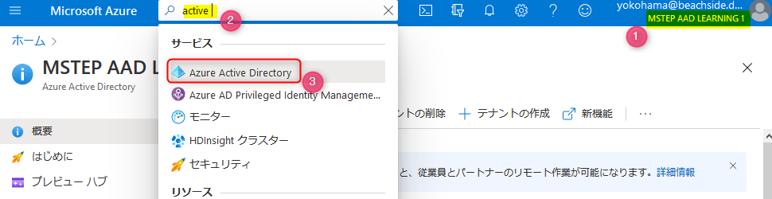
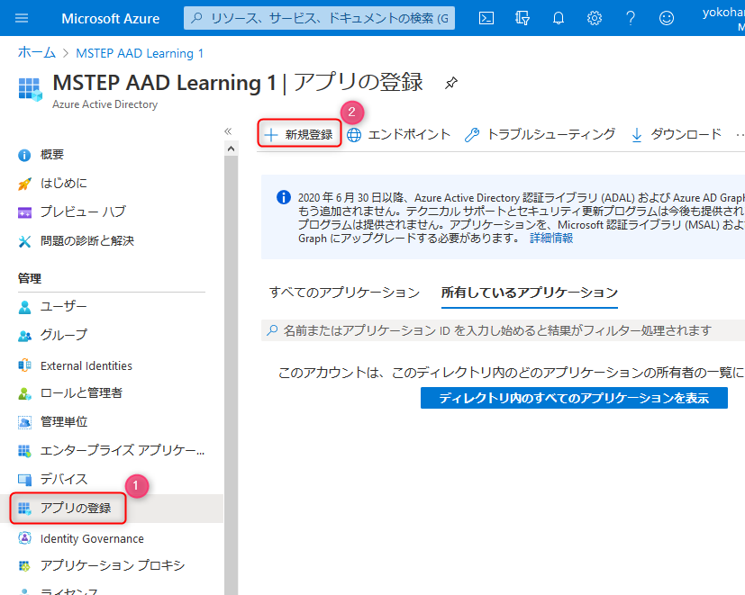
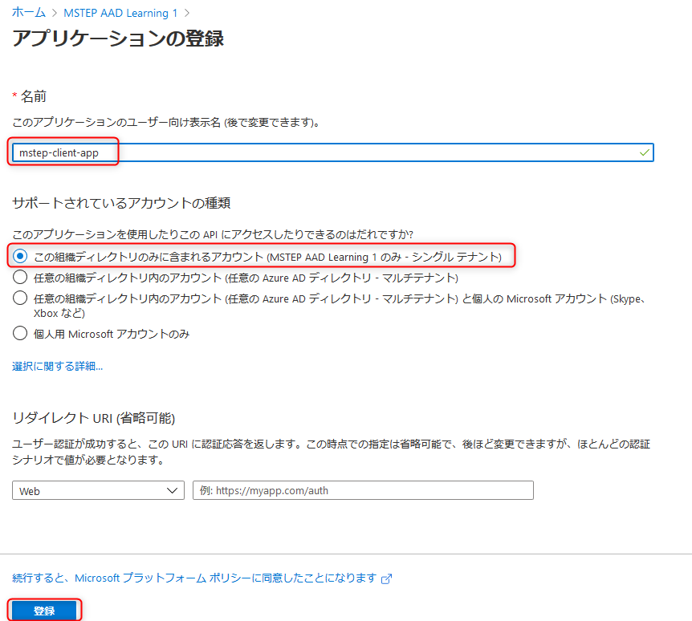
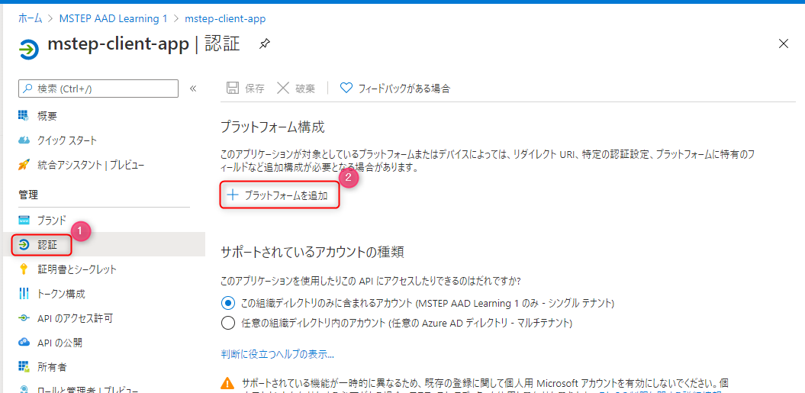
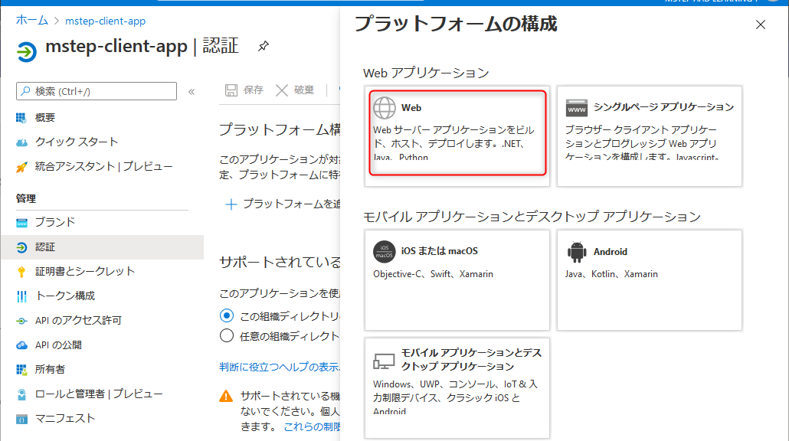
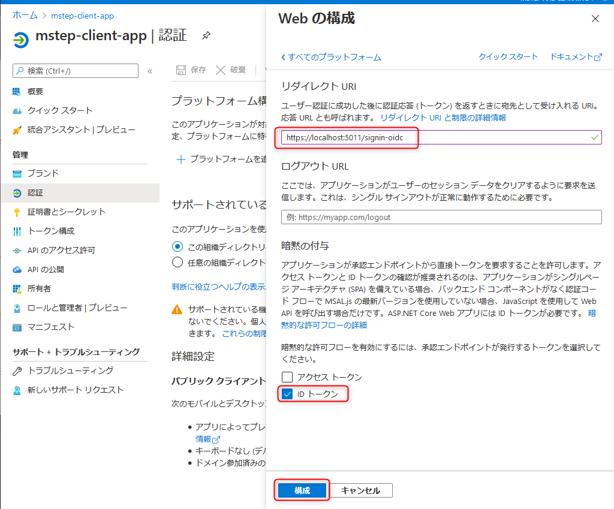
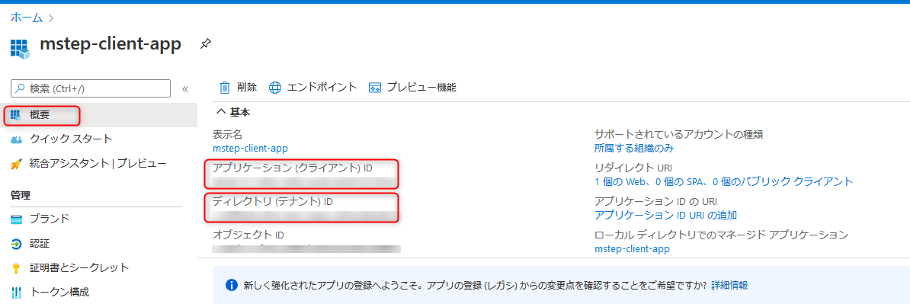

# 🚀 Azure Active Directory でアプリ登録を構成

ここでは Web アプリを Azure Acitive Directory で認証するために必要な、Azure Active Directory のアプリ登録を行います。

## 📜 Azure Active Directory を表示

ブラウザーで Azure ポータルを開き Azure Active Directory のリソースを表示します。以下を参考に表示できます。

- Azure ポータル ( https://portal.azure.com ) を開きます。
- 表示された画面上部右に表示されているディレクトリが正しいことを確認します (図①)。異なる場合はディレクトリを正しいディレクトリへ切り替えます。
- 画面上部の検索で「active」と入力します(図②)。
- Active Directory が表示されますので、クリックします (図③)。Azure Active Directory のリソースが表示されます。

 

## 📜 アプリの登録: 新規作成

- Azure Active Directory のリソースの左メニューで **アプリの登録** をクリックします (図①)。
- 画面上部の **新規登録** をクリック(図②)すると、**アプリケーションの登録** が表示されます。

 

- **名前** には任意の名称を入力します。
- **サポートされているアカウントの種類** はシングルテナントを選択します。
- **登録** ボタンをクリックして登録すると、作成したアプリが表示されます。

 

## 📜 アプリの登録: 認証を構成

- 左メニューの **認証** をクリックします (図①)。
- **プラットフォームの追加** をクリック(図②）すると、**プラットフォームの構成**が表示されます。

 

プラットフォームの構成で **Web** をクリックすると、**Web の構成** が表示されます。

 

以下のように入力します。

- リダイレクト URI: `https://localhost:5011/signin-oidc`
- 暗黙の付与: `ID トークン` にチェックを入れる

**構成** ボタンをクリックすると、Web のプラットフォームが追加されます。

 

## 📜 まとめ

以上で、インプリシットフローを実行する上でのアプリ登録の設定が完了しました。

次のワークショップでで以下の情報を利用します。メモしておきましょう。

- Web のリダイレクト URI で設定した値: `https://localhost:5011/signin-oidc`
- テナント ID と クライアント ID
  - 登録したアプリの **概要** をクリックすると表示されます。
  

 

---

[次へ進む: Web アプリの開発 (インプリシットフロー編)](./2_create_webapp-implicit.md)
