# 🚀 Web アプリの開発 (インプリシットフロー編)

ここでは、以下の開発を行います。

- <span>ASP</span>.NET Core MVC のプロジェクトを新規作成
- インプリシットフローの認証を構成
- 動作確認

インプリシットフロー (Implicit flow) についての詳細は、以下のドキュメントのご参照ください。

- [Microsoft identity platform and Implicit grant flow](https://docs.microsoft.com/ja-jp/azure/active-directory/develop/v2-oauth2-implicit-grant-flow)


<br>

## 📜 <span>ASP</span>.NET Core MVC のプロジェクトを新規作成

### プロジェクトの作成

Visual Studio 2019 を起動し、**新しいプロジェクトの作成** をクリックします。

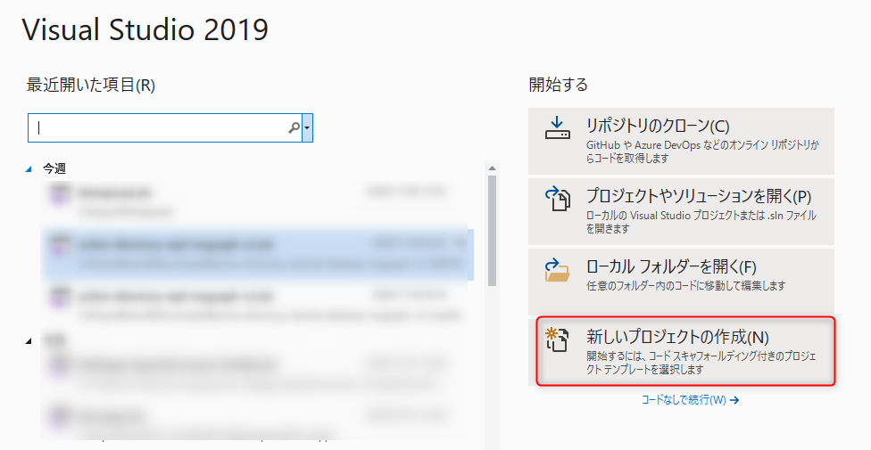

<br>

**C#** の **<span>ASP</span>.NET Core Web アプリケーション** を選択し、**次へ** をクリックします。

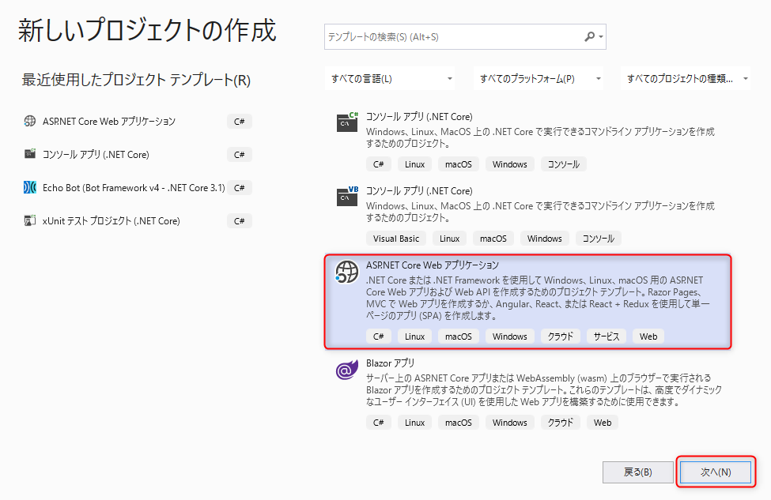

<br>

**プロジェクト名**、**場所**、**ソリューション名** に任意の値を入力し、**作成** ボタンをクリックします。

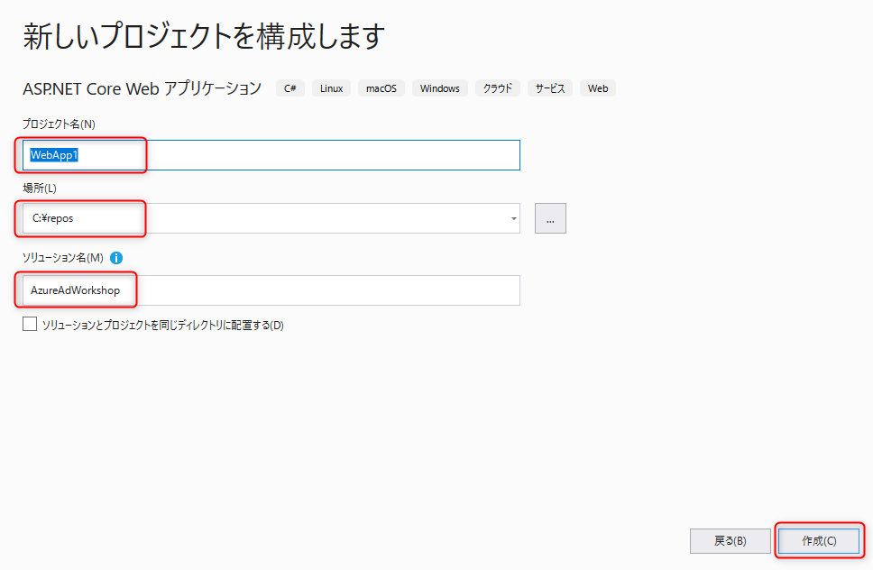

<br>

下図のように構成されていることを確認し、**作成** をクリックすると、<span>ASP</span>.NET Core Web アプリケーションのプロジェクトが作成されます。

- .NET Core
- <span>ASP</span>.NET Core 3.1
- Web アプリケーション (モデル ビュー コントローラー)
- 認証なし

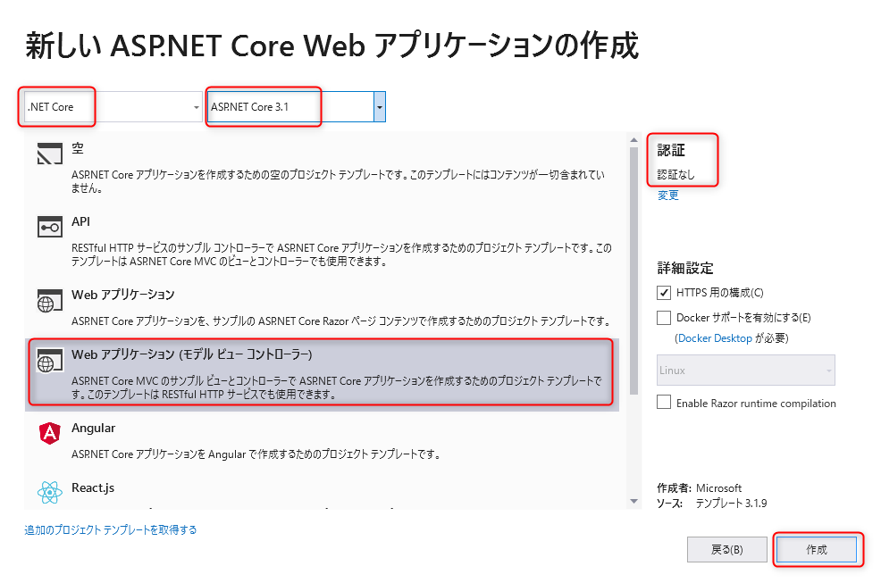

<br>

### デバッグの構成を変更

この後別の Web API を作成しこの Web アプリと同時にデバッグ実行をする都合から、この Web アプリのデバッグの構成を変更します。

**ソリューションエクスプローラー**でプロジェクト名を右クリックし(図①)、**プロパティ** をクリックしてプロジェクトのプロパティを開きます。

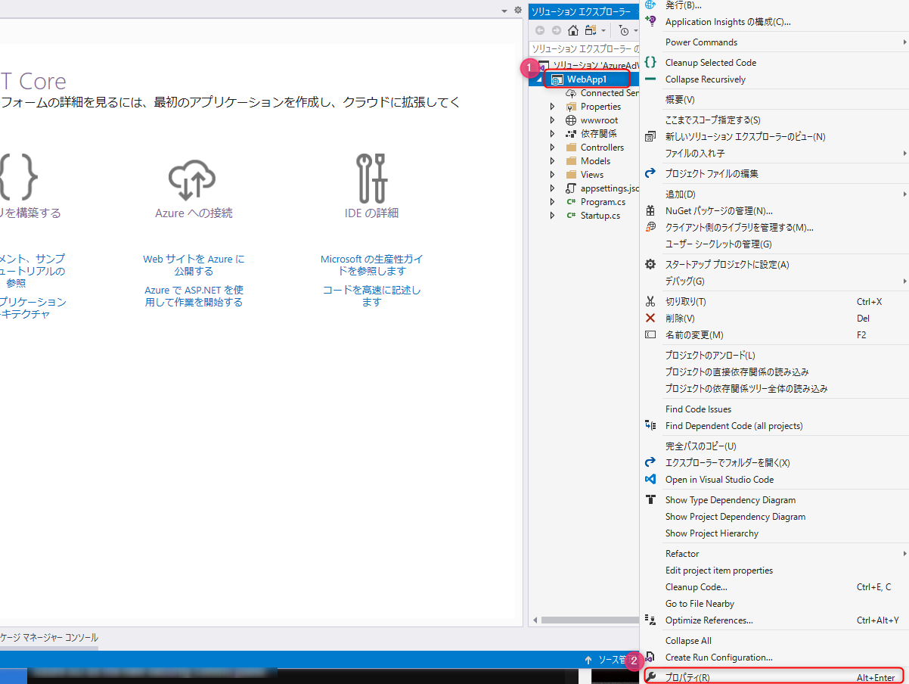

<br>

左メニューの **デバッグ** をクリックし以下のように構成します。

- プロファイル: IIS Express からプロジェクト名 (図の例だと `WebApp1`) に変更
- 起動: **プロジェクト** になっていることを確認
- ブラウザーの起動: チェックを外す
- アプリ URL: `https://localhost:5011;http://localhost:5010`

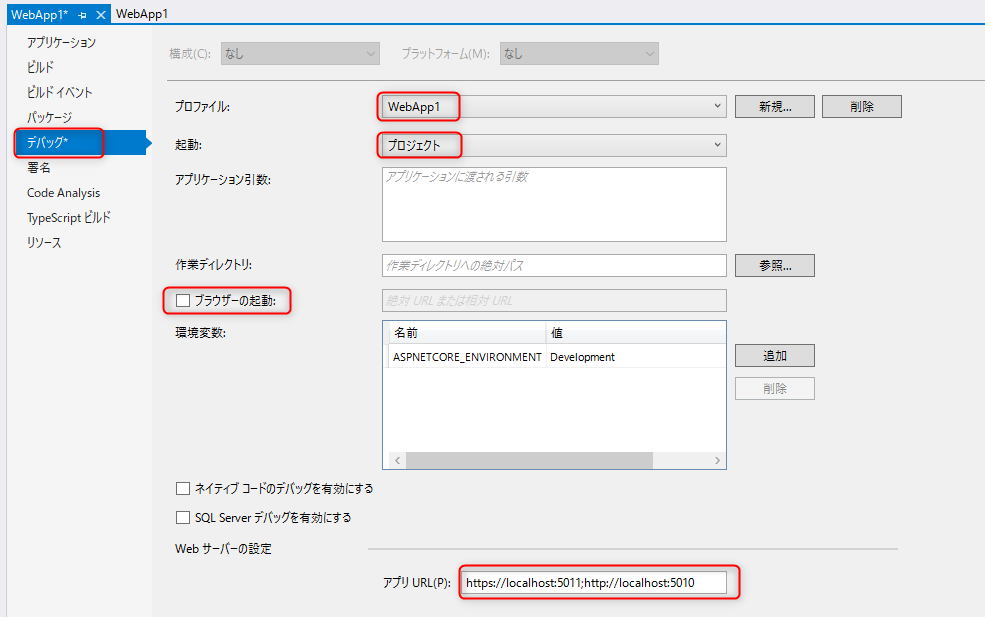

<br>

デバッグ実行して動作を確認します。▼ (図①)をクリックし、IIS Express からプロジェクト名 (図②の例だと `WebApp1`) に変更します。

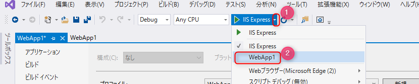

<br>

デバッグの実行をクリックします。

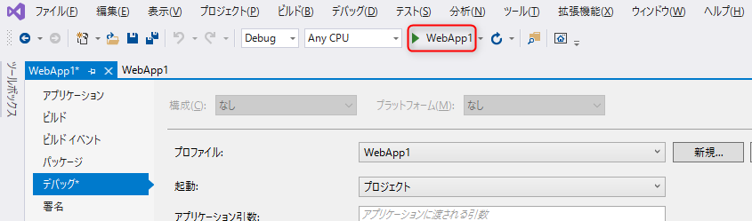

<br>

デバッグを実行するとコンソールが起動しますがブラウザは起動しません。これはこの後認証の動作を確認するためです。

ブラウザの Microsoft Edge で InPrivate ウィンドウ（Chrome の場合はシークレットウィンドウ）がひとつも開いてないことを確認してから、新しい InPrivate ウィンドウを起動します。

> 🔎 複数の InPrivate ウィンドウが開かれていると、Cookie の共有されて認証の動作を正確に確認できない可能性があるため、単一で InPrivate ウィンドウを開くことを推奨します。

InPrivate ウィンドウで `https://localhost:5011` を開きます。証明書に関する警告が表示された場合は許可して進みます。

以下のような画面が表示されると認証されずに正常に Web の画面が表示されることが確認できました。画面上部の **Privacy** をクリックし、このページも認証なしで表示されることを確認します。

動作確認を終えたらデバッグを停止します。

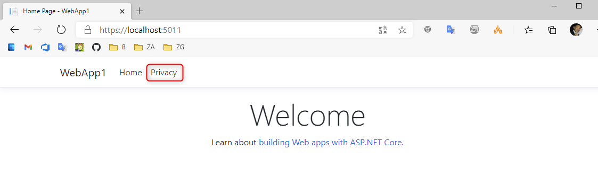

<br>

## 📜 インプリシットフローの認証を構成

### NuGet パッケージのインストール

<span>ASP</span>.NET Core で Azure Active Directory の認証に利用する **[Microsoft.Identity.Web](https://github.com/AzureAD/microsoft-identity-web)** のパッケージをインストールします。

> 🔎 ここで利用する最小限のパッケージは Microsoft.AspNetCore.Authentication.OpenIdConnect ですが、この後のワークショップで利用するパッケージも加味して Microsoft.Identity.Web をインストールします。

Visual Studio の上部にある検索に「nuget」と入力して **ソリューションの NuGet パッケージの管理...**をクリックします。

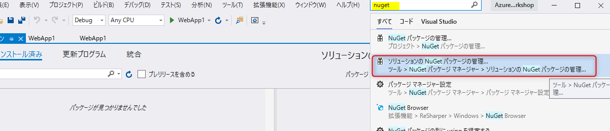

<br>

以下の操作を参考にしてインストールします。

- **参照** をクリック (図①)
- 検索で「<span>Microsoft.Identity.Web</span>」と入力 (図②)
- 検索結果として表示された **<span>Microsoft.Identity.Web</span>** をクリック (図③)
- インストールするプロジェクトにチェック (図④)
- **インストール** をクリック (図⑤)

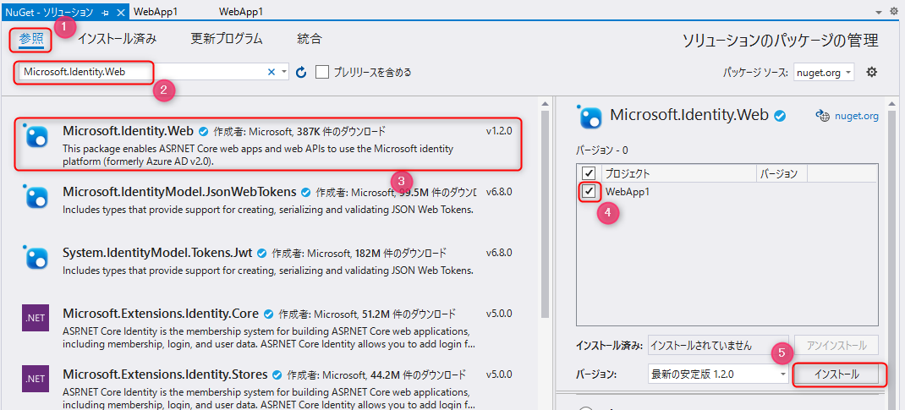

<br>

### Startup.cs の変更

Azure Active Directory を利用した認証を構成します。認証の構成は、`startup.cs` で行います。

> 🔎 <span>ASP</span>.NET Core の startup 自体の詳細については、[公式ドキュメント](https://docs.microsoft.com/ja-jp/aspnet/core/fundamentals/startup?view=aspnetcore-3.1) をご確認下さい。

ソリューションエクスプローラーで `startup.cs` を開き、`ConfigureServices` メソッドを以下のように変更します。その際 TODO と書かれてる2箇所を自身の Azure Active Directory の情報で書き換えます。

テナント ID は、値が `aaaa-bbbb-cccc-dddd-eeee` の場合、  
`options.Authority =$"https://login.microsoftonline.com/{"aaaa-bbbb-cccc-dddd-eeee"}/v2.0"`  
となります。

なお、using ステートメントは必要に応じて追加してください。

```cs
public void ConfigureServices(IServiceCollection services)
{
    services.AddAuthentication(options =>
        {
            options.DefaultScheme = CookieAuthenticationDefaults.AuthenticationScheme;
            options.DefaultChallengeScheme = OpenIdConnectDefaults.AuthenticationScheme;
        })
        .AddCookie(CookieAuthenticationDefaults.AuthenticationScheme)
        .AddOpenIdConnect(OpenIdConnectDefaults.AuthenticationScheme, options =>
        {
            options.SignInScheme = CookieAuthenticationDefaults.AuthenticationScheme;
            // TODO: "" にテナント ID を入力
            options.Authority = $"https://login.microsoftonline.com/{""}/v2.0";
            // TODO: "" にクライアント ID を入力
            options.ClientId = "";
            options.ResponseType = "id_token";
            options.SaveTokens = true;
            options.CallbackPath = "/signin-oidc";
        });
ｚ
    services.AddControllersWithViews();
}
```

<br>

次に `Configure` メソッドで、以下の TODO と書かれている1行を追加します。追加する場所に注意してください。

```cs
public void Configure(IApplicationBuilder app, IWebHostEnvironment env)
{
    if (env.IsDevelopment())
    {
        app.UseDeveloperExceptionPage();
    }
    else
    {
        app.UseExceptionHandler("/Home/Error");
        // The default HSTS value is 30 days. You may want to change this for production scenarios, see https://aka.ms/aspnetcore-hsts.
        app.UseHsts();
    }
    app.UseHttpsRedirection();
    app.UseStaticFiles();

    app.UseRouting();

    app.UseAuthentication();  // TODO: この行を追加
    app.UseAuthorization();

    app.UseEndpoints(endpoints =>
    {
        endpoints.MapControllerRoute(
            name: "default",
            pattern: "{controller=Home}/{action=Index}/{id?}");
    });
}
```

<br>

### HomeController.cs の変更

ソリューションエクスプローラーで `Controller` フォルダーの中にある `HomeController.cs` を開きます。

ここでは、Privacy のページを開くときのみ認証がかかるように設定します。

- `Privacy` メソッドの上に `[Authorize]` を追加します。
- `return View()` の行にブレークポイントをはっておきましょう。

```cs
[Authorize]  // TODO: この行を追加
public IActionResult Privacy()
{
    return View();
}
```

<br>

## 📜 動作確認

プロジェクトでデバッグ実行を開始し、以下の手順に沿ってブラウザーでページを開きます。

- ブラウザの Microsoft Edge で InPrivate ウィンドウ（Chrome の場合はシークレットウィンドウ）がひとつも開いてないことを確認してから、新しい InPrivate ウィンドウを開く
- ネットワークの状況を確認するために、ブラウザーの DevTools を起動してネットワークタブを開き、**ログの保持**にチェック
- `https://localhost:5011` を開く

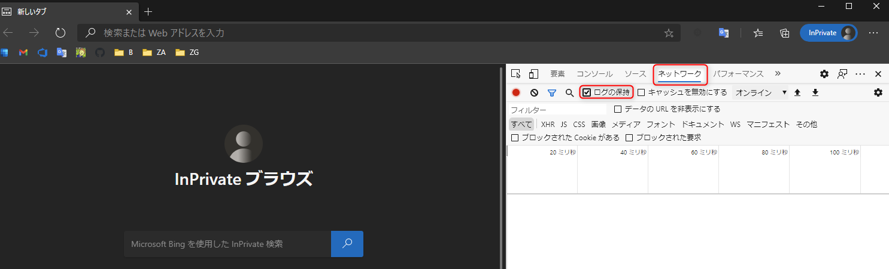

<br>

`https://localhost:5011` を開き、認証なしで表示されると正常です。Privacy をクリックしましょう。

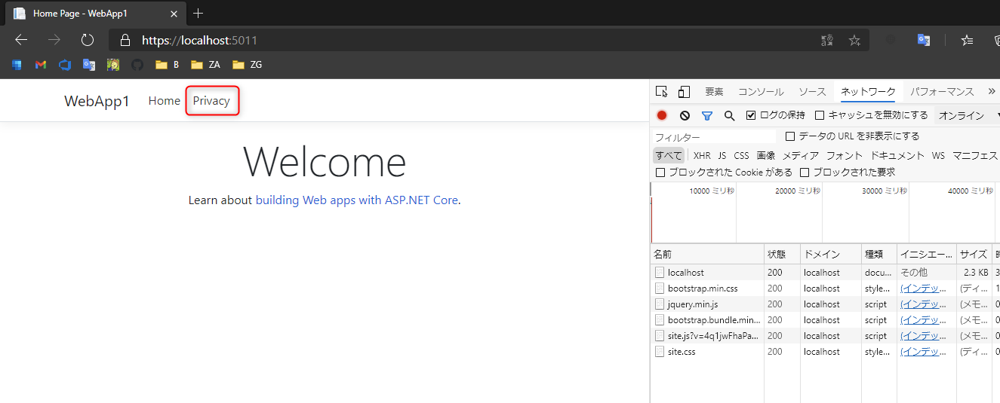

<br>

DevTools のネットワークを見てみましょう。と、Privacy を開いた際に `login.microsoftonline.com/` の authorize エンドポイントにリダイレクトされたことが確認できます(探しにくい場合は、ドキュメントのみの表示するようフィルターします）。`response_type` クエリパラメーターの値が `id_token` であることからインプリシットフローでの認証リクエストが行われていることが確認できます。

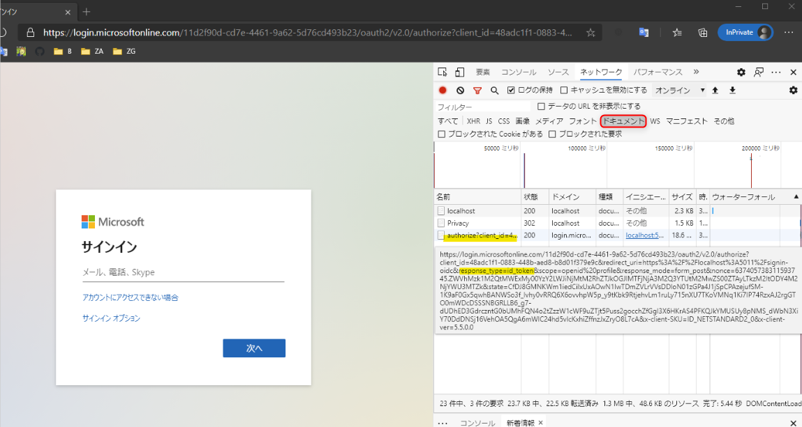

<br>

サインインを行うと、アクセス許可の同意を求める画面が表示されます。承諾すると Visual Studio のブレークポイントがヒットします。

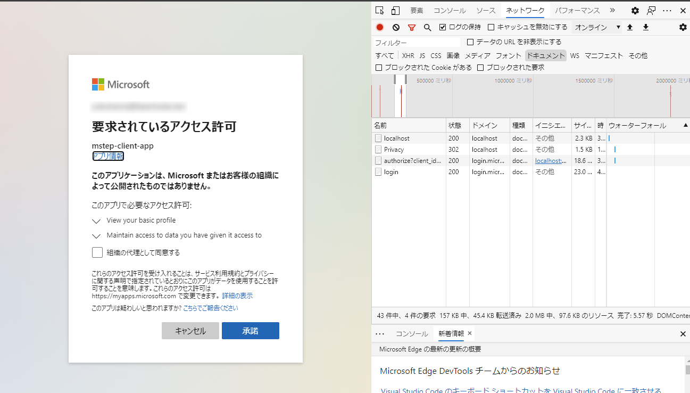

<br>

### ID トークンの確認

承諾後、DevTools のネットワークでは設定したコールバックの URL である `signin-oidc` が呼ばれていることが確認できます。これをクリックすると、フォームデータに id_token があることが確認できます。

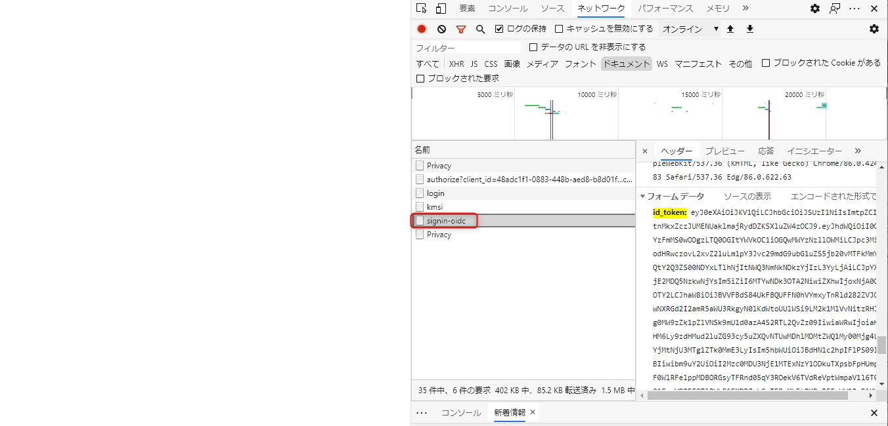

<br>

id_token の値をコピーして、https://jwt.ms を開きトークンをデコードすると、Azure AD から発行されたトークンの内容が確認できます。

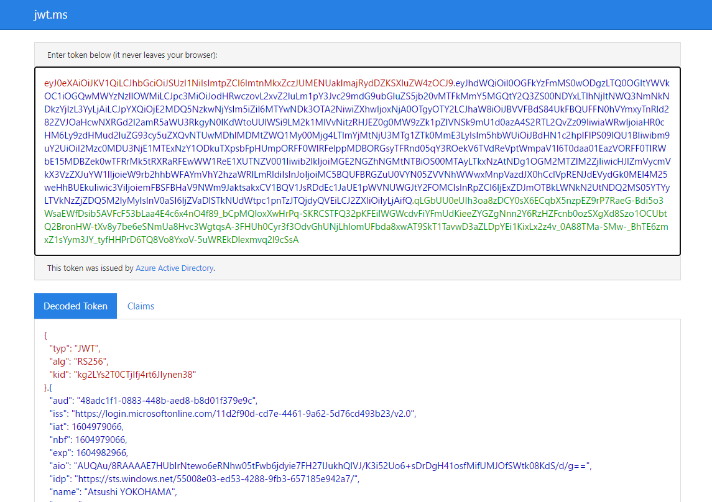

<br>


### <span>ASP</span>.NET Coreで認証の状況を確認

<span>ASP</span>.NET Core では、アクセスしてきたユーザーの状態を ControllerBase クラスの `User` プロパティ (System.Security.Claims.ClaimsPrincipal) で管理しています。このオブジェクトの内容を確認します。

Visual Studio でブレークポイントがとまっている HomeController.cs を見てみましょう。ブレークポイントが停まっているままの状態で、画面上部の検索で「ウォッチ」と入力し **クイック ウォッチ** を開きます。

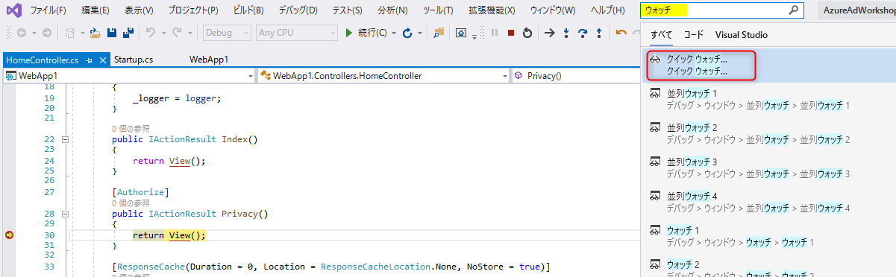

<br>


式に「User」と入力し Enter キーを推すと User プロパティの内容が確認できます。**Identity** を展開すると **IsAuthenticated** が `true` になっており、認証されていることがわかります。   また、**Claims** を展開すると、先ほど id_token をデコードして確認できた内容と同様のものが確認できます。

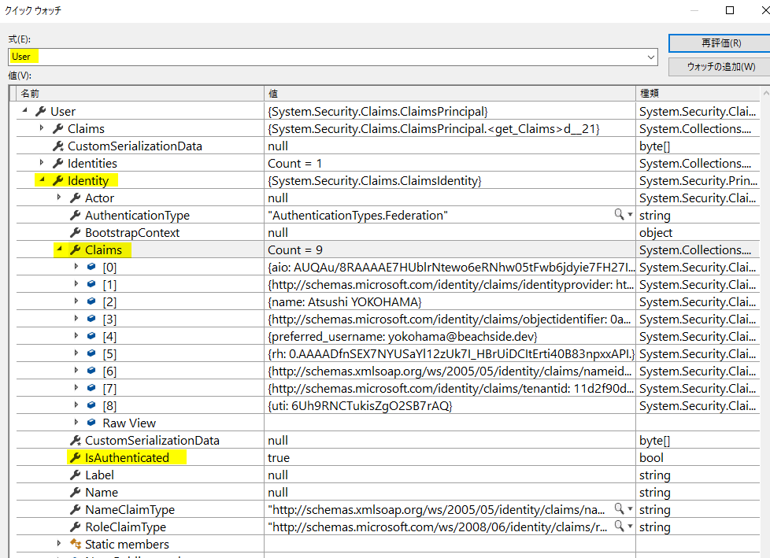

<br>

停止しているブレークポイントを実行して進めると、Privacy の画面が表示されます。


## 👍 まとめ

おめでとうざいます 🎉。

ここまで Azure Active Directory とインプリシットフローを使った認証が実現できました。完成したコードは [こちら](./src) にあります。

### 補足

このワークショップでは触れませんが、参考までに <span>ASP</span>.NET Core のセキュリティについて理解を深めたい場合は以下のドキュメントをご参考ください。

- [ASP.NET Core Security の概要](https://docs.microsoft.com/ja-jp/aspnet/core/security/?view=aspnetcore-3.1)

また、ここでは説明をシンプルにするため Active Directory の情報などをソースコードに直接書きましたが、通常は以下を参考に情報を保護します。

- [ASP.NET Core の構成](https://docs.microsoft.com/ja-jp/aspnet/core/fundamentals/configuration/?view=aspnetcore-5.0)
- [ASP.NET Core での開発におけるアプリシークレットの安全な保存](https://docs.microsoft.com/ja-jp/aspnet/core/security/app-secrets?view=aspnetcore-5.0&tabs=windows)

<br>

---

[次へ進む: Web アプリの開発 (認可コードフロー編)](../5-2-2_webapp-authorization-code/0_README.md)