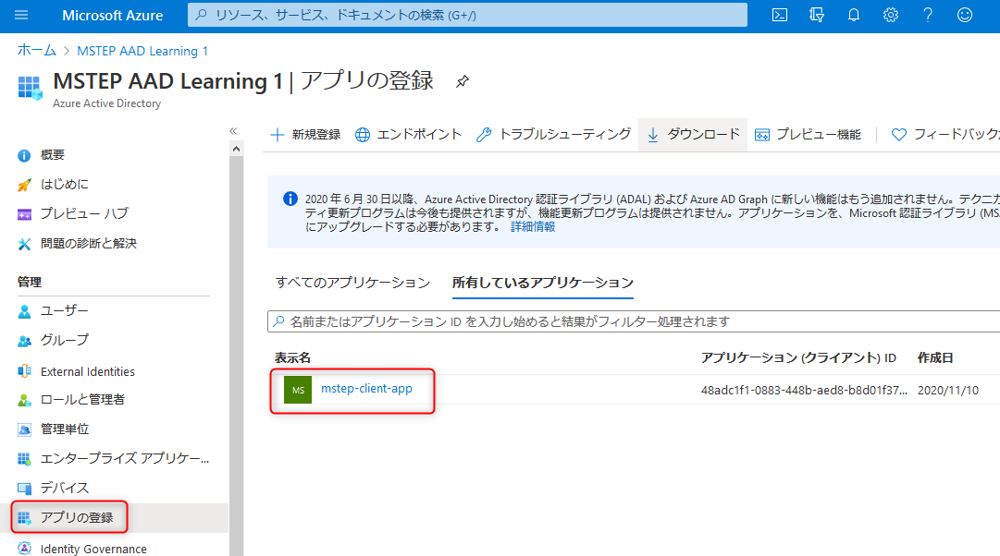
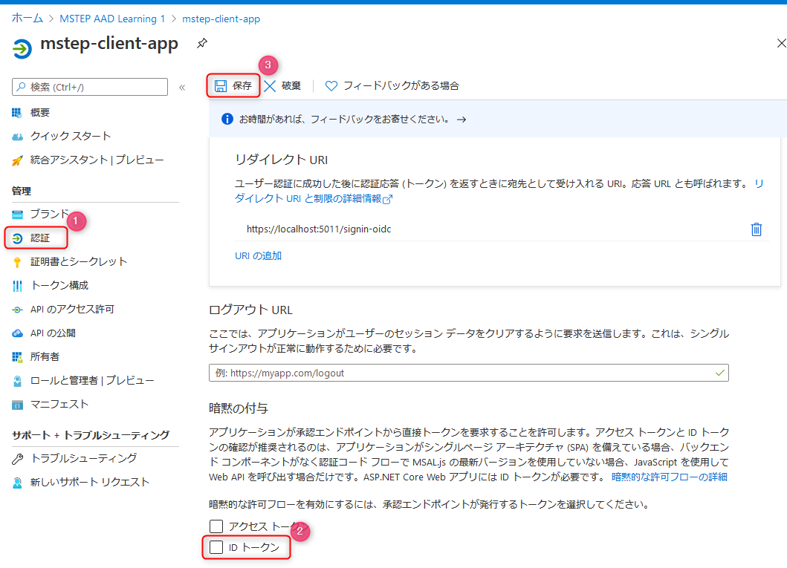
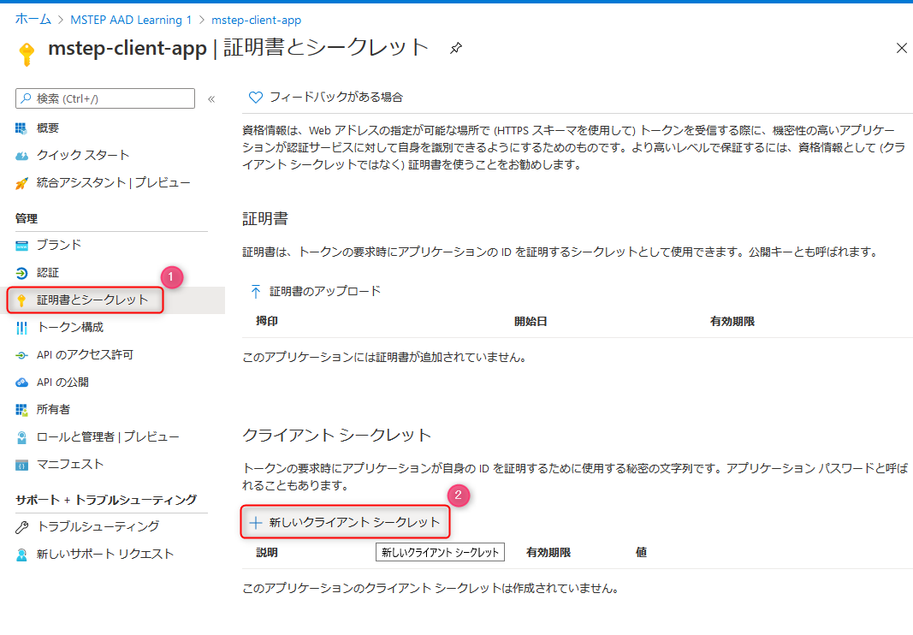
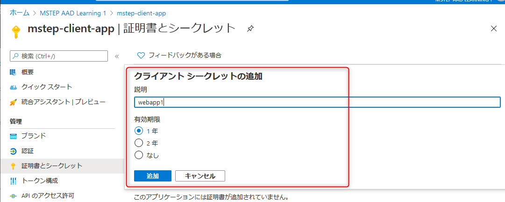

# 🚀 Azure Active Directory でアプリ登録を構成

ここでは、ASP.NET Core MVC で作成した Web アプリを 認可コードフロー (Authorization Code Flow with PKCE) で認証するために、前のワークショップで作成した Azure Active Directory のアプリ登録のアプリの構成を変更します。

- インプリシットフローを無効化
- アプリ登録: シークレットの生成

> これは Web アプリのプラットフォームを利用した際の構成方法であり、SPA のプラットフォームで認可コードフロー (Authorization Code Flow with PKCE) を利用する際の構成とは異なりますのでご注意ください。

## 📜 アプリを表示

Azure ポータルで Azure Active Directory のリソースを開き、**アプリの登録** をクリックして、前のコンテンツで作成したアプリをクリックして表示します。

 

## 📜 アプリ登録: インプリシットフローを無効化

**認証** をクリックし (図①) 、**暗黙の付与** の下にある **ID トークン**のチェックを外します (図②) 。

最後に画面上部の **保存** をクリックします (図③) 。

これでインプリシットフローは利用できなくなります。

 

## 📜 アプリ登録: シークレットの生成

認可コードフロー (Authorization Code Flow with PKCE) で利用するクライアントのシークレットを生成します。

**証明書とシークレット** をクリックし (図①) 、**新しいクライアントシークレット** をクリックします (図②) 。

 

説明と有効期限を任意の値で設定します。**追加** をクリックするとクライアントシークレットが生成されます。

 

クライアントシークレットの値は、後ほどプログラムで利用するため、メモしておきます。

## 📜 まとめ

以上で、Webアプリで認可コードフロー (Authorization Code Flow with PKCE) を利用する際の設定は完了しました。

次はソースコードを変更します。

---

[次へ進む: Web アプリの開発 (認可コードフロー編)](./2_create_webapp-authorization-code.md)
