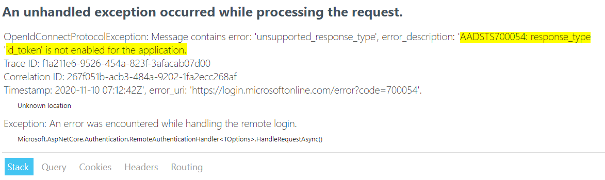
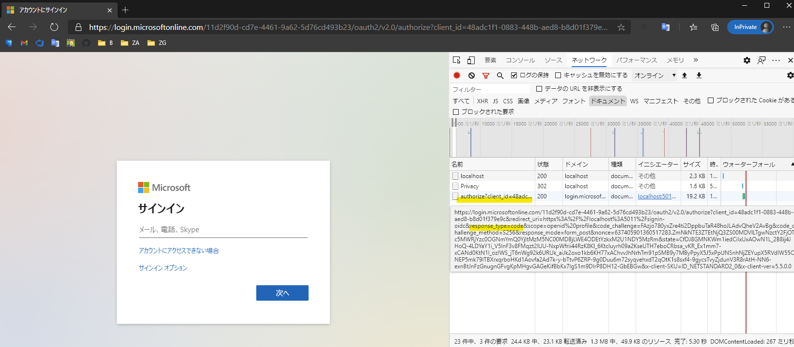
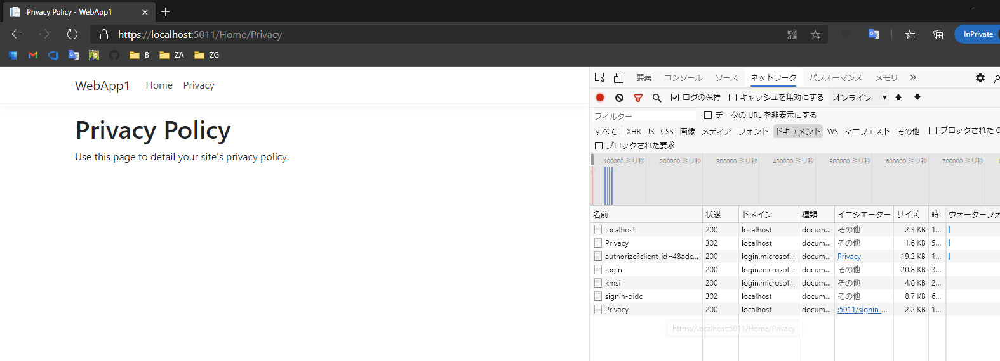

# 🚀 Web アプリの開発 (認可コードフロー編)

ここでは、前のワークショップで開発した<span>ASP</span>.NET Core MVC で作成した Web アプリを改修して、以下の開発を行います。

- インプリシットフローがサポート外になったのを確認
- 認可コードフロー (Authorization Code Flow with PKCE) の実装
- 動作確認

認可コードフロー (Authorization Code Flow with PKCE) についての詳細は、以下のドキュメントのご参照ください。

- [Microsoft identity platform and OAuth 2.0 authorization code flow](https://docs.microsoft.com/ja-jp/azure/active-directory/develop/v2-oauth2-auth-code-flow)

<br>

## インプリシットフローがサポート外になったのを確認

まず、アプリ登録の設定変更により先ほどまで認証ができていた <span>ASP</span>.NET Core MVC のプロジェクトの認証ができなくなったのを確認します。

プロジェクトでデバッグ実行を開始し、以下の手順に沿ってブラウザーでページを開きます。

- ブラウザの Microsoft Edge で InPrivate ウィンドウ（Chrome の場合はシークレットウィンドウ）がひとつも開いてないことを確認してから、新しい InPrivate ウィンドウを開く
- `https://localhost:5011` を開く


> 🔎 複数の InPrivate ウィンドウが開かれていると、Cookie の共有されて認証の動作を正確に確認できない可能性があるため、単一で InPrivate ウィンドウを開くことを推奨します。

画面上部の **Privacy** をクリックして認証を行うと、エラーが発生しインプリシットフローで認証がサポート外になっていることが確認できます。



<br>

## 📜 認可コードフローの実装

インプリシットフローで認証していたプログラムを、認可コードフロー (Authorization Code Flow with PKCE) で認証するように変更します。

前のワークショップで作成した <span>ASP</span>.NET Core MVC のプロジェクトで Startup.cs を開き、以下のように変更します。using ステートメントは必要に応じて追加します。

- **テナント ID**・**クライアント ID** はインプリシットフローで利用していた値と同一です。
- **クライアントシークレット**は前のワークショップで生成した値です。

```cs
public void ConfigureServices(IServiceCollection services)
{
    services.AddAuthentication(options =>
        {
            options.DefaultScheme = CookieAuthenticationDefaults.AuthenticationScheme;
            options.DefaultChallengeScheme = OpenIdConnectDefaults.AuthenticationScheme;
        })
        .AddCookie(CookieAuthenticationDefaults.AuthenticationScheme)
        .AddOpenIdConnect(OpenIdConnectDefaults.AuthenticationScheme, options =>
        {
            options.SignInScheme = CookieAuthenticationDefaults.AuthenticationScheme;
            // TODO: "" にテナント ID を入力
            options.Authority = $"https://login.microsoftonline.com/{""}/v2.0";
            // TODO: "" にクライアント ID を入力
            options.ClientId = "";
            // TODO: "" にクライアントシークレットを入力
            options.ClientSecret = "";
            options.ResponseType = OpenIdConnectResponseType.Code;
            options.SaveTokens = true;
            options.CallbackPath = "/signin-oidc";
        });

    services.AddControllersWithViews();
}
```

<br>

## 📜 動作確認

プロジェクトをデバッグ実行し、以下の手順に沿ってブラウザーでページを開きます。

- ブラウザの Microsoft Edge で InPrivate ウィンドウ（Chrome の場合はシークレットウィンドウ）がひとつも開いてないことを確認してから、新しい InPrivate ウィンドウを開く
- ネットワークの状況を確認するために、ブラウザーの DevTools を起動してネットワークタブを開き、**ログの保持**にチェック
- `https://localhost:5011` を開く

次に Privacy ページを開くと、ネットワークで authorization エンドポイントにリダイレクトされていることが確認できます。`response_type` クエリパラメーターの値が `code` であることから認可コードフロー (Authorization Code Flow with PKCE) での認証リクエストが行われていることが確認できます。



<br>

ログイン情報を入力し、正常にログインできることが確認できます。



<br>

## 👍 まとめ

おめでとうざいます🎉。

ここまで Azure Active Directory で認可コードフロー (Authorization Code Flow with PKCE)を使った認証が実現できました。完成したコードは [こちら](./src) にあります。

次は、Azure Active Directory の認証で保護された Web API の開発と、ここで作成した Web アプリから Web API を呼ぶための実装を行います。

### 補足

このワークショップでは触れませんが、参考までに <span>ASP</span>.NET Core のセキュリティについて理解を深めたい場合は以下のドキュメントをご参考ください。

- [ASP.NET Core Security の概要](https://docs.microsoft.com/ja-jp/aspnet/core/security/?view=aspnetcore-3.1)

また、ここでは説明をシンプルにするため Active Directory の情報などをソースコードに直接書きましたが、通常は以下を参考に情報を保護します。

- [ASP.NET Core の構成](https://docs.microsoft.com/ja-jp/aspnet/core/fundamentals/configuration/?view=aspnetcore-5.0)
- [ASP.NET Core での開発におけるアプリシークレットの安全な保存](https://docs.microsoft.com/ja-jp/aspnet/core/security/app-secrets?view=aspnetcore-5.0&tabs=windows)

<br>

---

[次へ進む: Web アプリから Web API をコールする認証の実装](../5-2-3_webapp-webapi/0_README.md)
