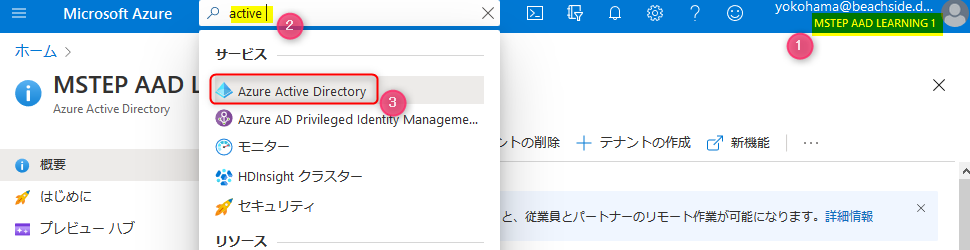

# 🚀 Azure Active Directory でアプリ登録を構成

ここでは Web API を Azure Acitive Directory で保護するために、Azure Active Directory のアプリ登録を行います。

## 📜 Azure Active Directory を表示

ブラウザーで Azure ポータルを開き Azure Active Directory のリソースを表示します。以下を参考に表示できます。

- Azure ポータル ( https://portal.azure.com ) を開きます。
- 表示された画面上部右に表示されているディレクトリが正しいことを確認します (図①)。異なる場合はディレクトリを正しいディレクトリへ切り替えます。
- 画面上部の検索で「active」と入力します(図②)。
- Active Directory が表示されますので、クリックします (図③)。Azure Active Directory のリソースが表示されます。

 

## 📜 アプリの登録: 新規作成

- Azure Active Directory のリソースの左メニューで **アプリの登録** をクリックします (図①)。
- 画面上部の **新規登録** をクリック(図②)すると、**アプリケーションの登録** が表示されます。

 

- **名前** には任意の名称を入力します。
- **サポートされているアカウントの種類** はシングルテナントを選択します。
- **登録** ボタンをクリックして登録すると、作成したアプリが表示されます。

 

## 📜 アプリの登録: API の公開

このアプリが他のアプリに公開できるようにスコープを定義します。

左メニューの **API の公開** をクリックし (図①) 、**スコープの追加** をクリックします(図②）。

 

**スコープの追加** が表示されます。初めて作成する場合は、アプリケーション ID の URI を設定する画面が表示されます。**保存してから続ける** をクリックします。

 

スコープの定義を入力します。

- **スコープ名**: 用途に応じて適宜入力します。今回は `DefaultAccess` としました。

スコープ名以降の入力は、認証時に表示されるアクセス許可の画面の制御に関するものです。以下図を参考に適宜入力します。

入力後、**スコープの追加** ボタンをクリックして登録します。

 

以下の値は、この後の開発で利用しますのでメモをしておきます。

- アプリケーション ID のURI (図①)
- スコープの ID (図②)

 

## 📜 まとめ

以上で Web API を Azure Ative Directory で保護するためのアプリ登録の設定が完了しました。  
次は、ASP.NET Core の Web API を開発します。

---

[次へ進む: Web API の開発](./2_create_webapi.md)