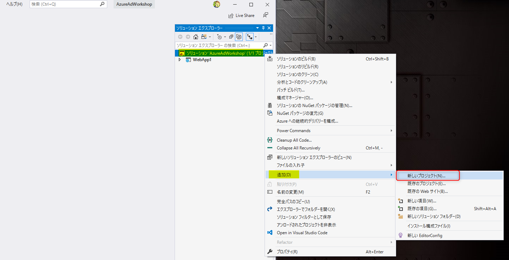
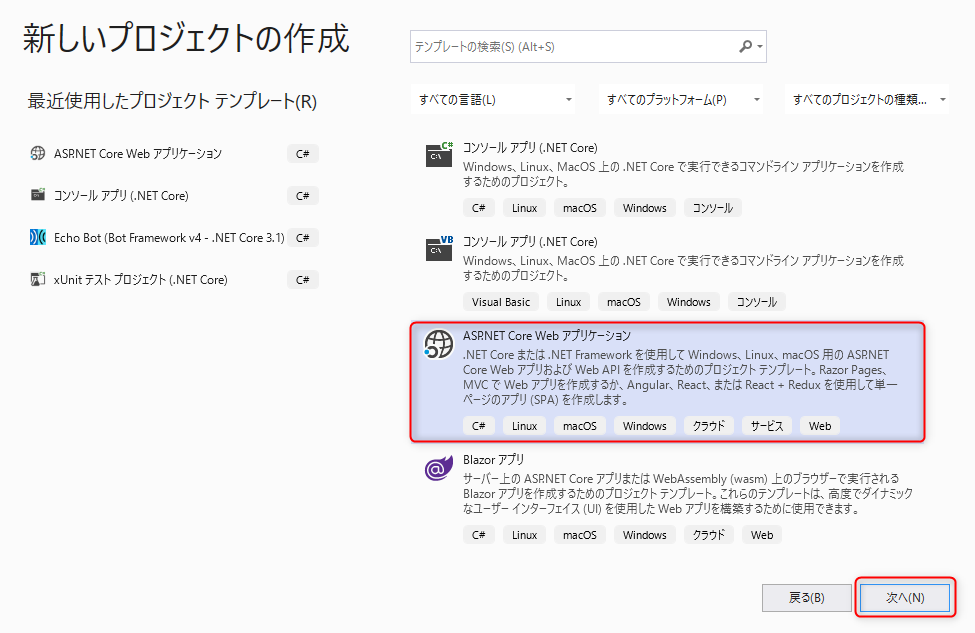
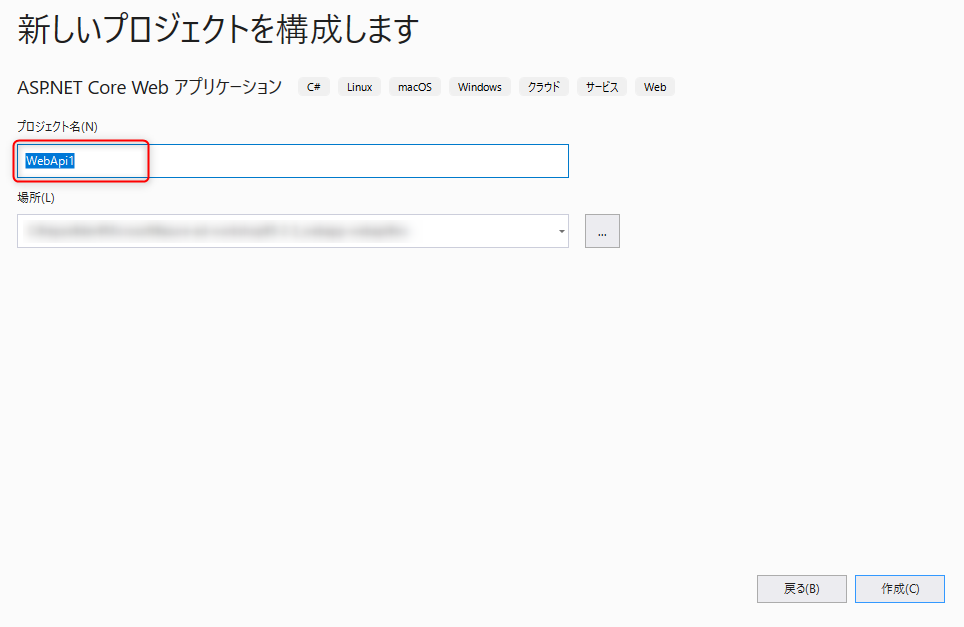
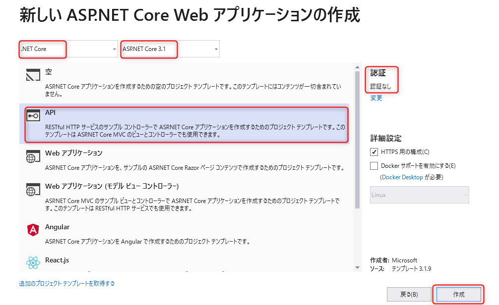
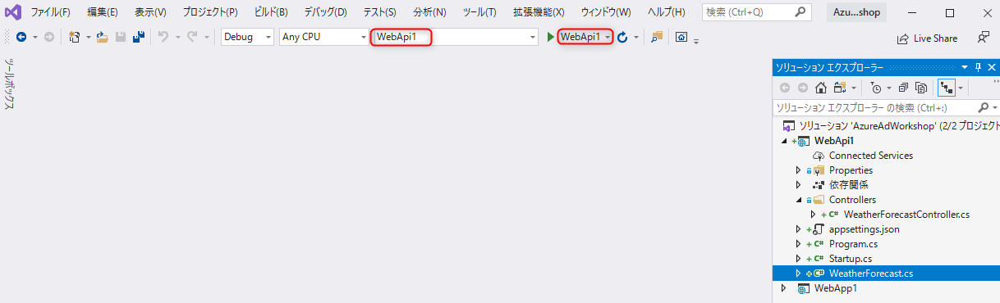
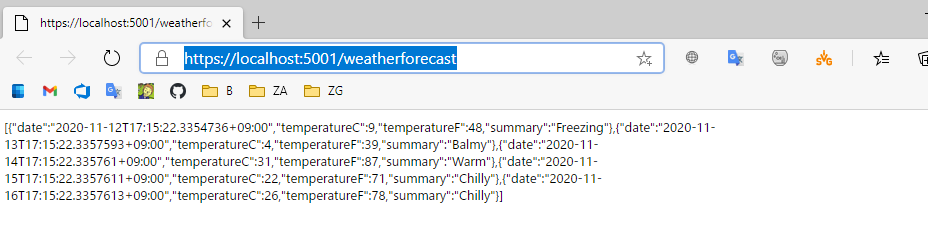
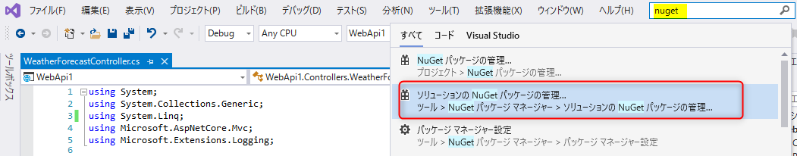
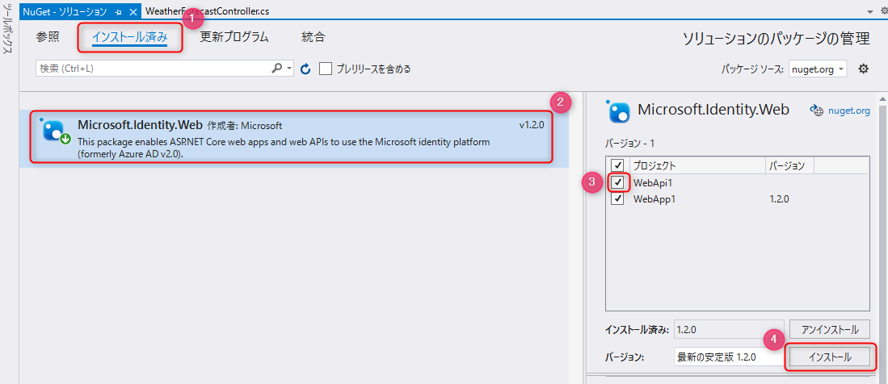
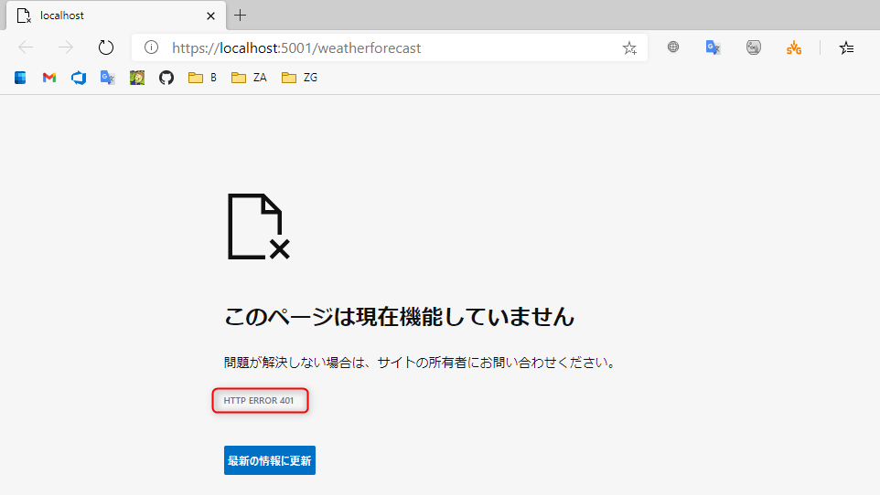

# 🚀 Web API の開発

ここでは、Azure Active Directory で保護された <span>ASP</span>.NET Core Web API を開発します。

Web API の利用ケースは、クライアントのアプリが Azure Active Directory で認証をしてトークンを取得し、そのトークンを使って Web API にアクセスをします。

この認証が通るように実装をします。

## 📜 <span>ASP</span>.NET Core Web API のプロジェクトを新規作成

前のコンテンツで作成した Web アプリと同じソリューションに Web API のプロジェクトを追加して開発を進めます。

### プロジェクトの作成

Visual Studio のソリューションエクスプローラーでソリューション名を右クリックし **追加** をクリックして、**新しいプロジェクト** をクリックします。



<br>

**C#** の **<span>ASP</span>.NET Core Web アプリケーション** を選択し、**次へ** をクリックします。



<br>

**プロジェクト名** に任意の値を入力し、**作成** ボタンをクリックします。



<br>

下図のように構成されていることを確認し、**作成** をクリックすると、<span>ASP</span>.NET Core の Web API プロジェクトが作成されます。

- .NET Core
- <span>ASP</span>.NET Core 3.1
- API
- 認証なし



<br>

### 認証なしでの動作確認

まず、作成した Web API が認証なしの状態で正常に動作することをデバッグ実行して確認しましょう。

デバッグを実行する前に、デバッグ実行の対象を確認します。下図のように2箇所がプロジェクト名になっていることを確認します。



<br>

確認をしたらデバッグ実行をします。正常に実行できると、ブラウザが起動して `https://localhost:5001/weatherforecast` が表示されます (ポート番号は異なる場合もあります)。



**この URI はメモしてください。後続のワークショップで利用します。**

<br>

この動作は、起動時にこの URL が起動するよう Properties/launchSettings.json で定義されているためです。  
コードは、Controllers/WeatherForecastController.cs の `Get` メソッドが呼ばれています。

ここまでで、Web API が認証なしの状態で正常に動作することを確認できました。

<br>

## 📜 認証を構成

### NuGet パッケージのインストール

<span>ASP</span>.NET Core で Azure Active Directory の認証に利用する **[Microsoft.Identity.Web](https://github.com/AzureAD/microsoft-identity-web)** のパッケージをインストールします。

> 🔎 ここで利用する最小限のパッケージは Microsoft.AspNetCore.Authentication.JwtBearer ですが、前のワークショップで利用するパッケージも加味して [Microsoft.Identity.Web](https://github.com/AzureAD/microsoft-identity-web) をインストールしています。

Visual Studio の上部にある検索に「nuget」と入力して **ソリューションの NuGet パッケージの管理** をクリックします。



<br>

以下の操作を参考にしてインストールします。

- **インストール済み** をクリック (図①)
- **<span>Microsoft.Identity.Web</span>** をクリック (図②)
- Web API のプロジェクトをチェック (図③)
- **インストール** をクリック (図④)



<br>

### Startup.cs の変更

認証の構成は、`startup.cs` で行います。

> 🔎 <span>ASP</span>.NET Core の startup 自体の詳細については、[公式ドキュメント](https://docs.microsoft.com/ja-jp/aspnet/core/fundamentals/startup?view=aspnetcore-3.1) をご確認下さい。

ソリューションエクスプローラーで **Web API のプロジェクト** の `startup.cs` を開き、`ConfigureServices` メソッドを以下のコードを参考に変更します。

- TODO と書かれてる2箇所を自身の Azure Active Directory の情報で書き換えます。
- テナント ID は、値が `aaaa-bbbb-cccc-dddd-eeee` の場合、  
`options.Authority =$"https://login.microsoftonline.com/{"aaaa-bbbb-cccc-dddd-eeee"}/v2.0"`  
となります。
- using ステートメントは必要に応じて追加します。

```cs
public void ConfigureServices(IServiceCollection services)
{
    services.AddAuthentication(JwtBearerDefaults.AuthenticationScheme)
        .AddJwtBearer(JwtBearerDefaults.AuthenticationScheme, options =>
        {
            // TODO: "" にテナント ID を入力
            options.Authority = $"https://login.microsoftonline.com/{""}/v2.0";
            // TODO: "" に、API の公開で生成した Application ID URI を入力
            options.Audience = "";
            // 有効な Issuer を個別に登録することも可能だがここでは全ての Issuer を有効とする
            options.TokenValidationParameters.ValidateIssuer = false;
        });

    services.AddControllers();
}
```

<br>

> 🔎 クライアント（前のワークショップで開発した Web アプリ) とここで開発してる Web API で Azure Active Directory のアプリが同一の場合は、Audience にクライアント ID をセットして認証を通過させることが可能です。今回はアプリが別々のため のアプリが同一の場合は、Audience に Application ID URI を設定しています。

<br>

次に `Configure` メソッドで、以下の TODO と書かれている1行を追加します。追加する場所に注意してください。

```cs
        public void Configure(IApplicationBuilder app, IWebHostEnvironment env)
        {
            if (env.IsDevelopment())
            {
                app.UseDeveloperExceptionPage();
            }

            app.UseHttpsRedirection();

            app.UseRouting();

            app.UseAuthentication(); // TODO: この行を追加
            app.UseAuthorization();

            app.UseEndpoints(endpoints =>
            {
                endpoints.MapControllers();
            });
        }
```

<br>

### WeatherForecastController.cs の変更

WeatherForecastController.cs を開き、クラス名の上部に `[Authorize]` をつけます。これで、クラスのメソッド全体が認証で保護されます。

```cs
[Authorize]
[ApiController]
[Route("[controller]")]
public class WeatherForecastController : ControllerBase
```

<br>

## 📜 動作確認

プロジェクトをデバッグ実行すると、認証で保護されているため HTTP Status Code が 401 (Unauthorized) でアクセス不可になりました。正常な動作です。



<br>

## 📜まとめ

ここまでで認証で保護された Web API を開発しました。

次は、前のコンテンツで作成した Web アプリから認証で保護された Web API をコールする開発を行います。

なお **認証なしでの動作確認** のセクションでメモをした URI は次のワークショップで利用します。

<br>

---

[次へ進む: Web アプリから Web API をコールする認証の実装](./3_webapp-call-downstream-api.md)
