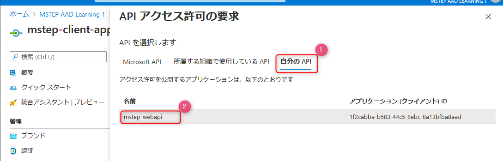

# Web アプリから保護された Web API をコールする

ここでは、Web アプリで Azure Active Directory で認証し、そのトークンを利用して Azure Active Directory で保護された Web API をコールする実装を行います。

## 📜 Web アプリの変更

Web アプリで認証したトークンを使って Web API をコールする実装を行います。この段階では、Azure Active Directory のアプリ間でアクセス許可の設定を行っていないため、デバッグ実行するとエラーになることを確認します。

### HomeController の変更

※ using ステートメントは適宜追加してください。

まずクラスのメンバー変数に以下を追加します。

```cs
private readonly IHttpClientFactory _httpClientFactory;
```

コンストラクターの引数で `IHttpClientFactory` を受け取り、メンバー変数にセットします。

> `IHttpClientFactory` の値は、Dependency Injection の機能をインスタンスを受け取るため、後ほど Startup.cs で設定を行います。

```cs
public HomeController(IHttpClientFactory httpClientFactory, ILogger<HomeController> logger)
{
    _httpClientFactory = httpClientFactory;
    _logger = logger;
}
```

以下のメソッドを HomeController クラスに追加します。  
TODO として記載している部分について、コードでは `https://localhost:5001/weatherforecast` をセットしていますが、前のワークショップで Web API を実行したときのものをセットします。

```cs
[Authorize]
public async Task Weather()
{
    // アクセストークンを取得
    var accessToken = await HttpContext.GetTokenAsync("access_token");

    var httpClient = _httpClientFactory.CreateClient();
    // HTTP リクエストのメッセージを生成
    // TODO: URI には Web API のデバッグ時の URI をセット
    var request = new HttpRequestMessage(
        HttpMethod.Get,
        "https://localhost:5001/weatherforecast"
        );
    // アクセストークンをヘッダーに追加
    request.Headers.Authorization = new AuthenticationHeaderValue("Bearer", accessToken);
    // Web API をコール
    var response = await httpClient.SendAsync(request);

    _logger.LogDebug(response.StatusCode.ToString());

    response.EnsureSuccessStatusCode();

    var result = await response.Content.ReadAsStringAsync();
}
```


### Startup.cs の変更

HomeController のコンストラクターで `IHttpClientFactory` を利用しているため、正しくインスタンスを呼び出すために Dpendency Injection の設定を行います。

Startup.cs を開き、`ConfigureServices` メソッドに次の一行を追加します。

```cs
services.AddHttpClient();
```

### ブレークポイントのセット

動作確認を効率的にために、**Web アプリのプロジェクト**の HomeController.cs でブレークポイントを2箇所セットします。

1つは `Weather` メソッドがコールされたことを確認するためにアクセストークンを取得する部分にブレークポイントをセットします。

2つめは `Weather` メソッド内の `response.EnsureSuccessStatusCode();` の行でブレークポイントをセットしておきます。

次に **Web API のプロジェクト**では、WeatherForecastController.cs の `Get` メソッドがコールされたことを確認するために `var rng = new Random();` の行にセットしておきましょう。

<br>


## 📜 認証エラーになることを確認

デバッグ実行を行い、Azure Active Dirctory のアプリ間のアクセス許可を設定していないため認証でエラーになることを確認します。

### 2つのプロジェクトを同時にデバッグ実行する設定

ソリューションで Web アプリと Web API の2つを同時にデバッグ実行する設定を行います。

ソリューションエクスプローラーでソリューション名を右クリックし、**プロパティ** をクリックします。


**スターアッププロジェクト** で **マルチスタートアッププロジェクト** を選択します。そして2つのプロジェクトのアクションを **開始** に設定し、**OK**ボタンをクリックします。これで設定完了です。


<br>

### デバッグ実行

デバッグを開始すると、2つのプロジェクトのデバッグが開始します。

Web アプリの動作を確認するために以下の手順でブラウザーを起動します。

- ブラウザの Microsoft Edge で InPrivate ウィンドウ（Chrome の場合はシークレットウィンドウ）がひとつも開いてないことを確認してから、新しい InPrivate ウィンドウを開く
- `https://localhost:5011` を開く

正常に Home の画面が起動したことを確認したら、ブラウザーの URL に `https://localhost:5011/home/weather` を入力してアクセスします。

正常に動作していると認証の画面に遷移しますので、ログインします。正常にログインすると、`Weather` メソッドでブレークポイントがヒットします。


<br>

F5 キーをおして次のブレークポイントまでデバッグを進めます。


<br>

アクセストークンが取得できているかを変数から確認します。


<br>

Web API のレスポンスのステータスコードについて、コードやデバッグコンソールを見て 401 (Unauthorized) になっていると、正常に動作しています。

正常に動作できることを確認出来たらデバッグを終了します。


<br>

ここまでで他のエラーが表示されていたり、Web API の WeatherForecastController が呼ばれていると設定やコードに問題がるため、状況に応じて見直します。

<br>

## 📜 アプリ登録の変更

Azure ポータルで Azure Active Directory のリソースを開き、**アプリ登録** をクリックします。ここまでのワークショップで、Azure Active Directory のアプリ登録には2つのアプリがあることが Azure ポータルで確認できます。

- mstep-client-app: Web アプリで使っているアプリ
- mstep-webapi: Web API で使っているアプリ


<br>

**mstep-client-app** が **mstep-webapi** のスコープをアクセスを許可できるよう設定します。

<br>

### アプリ登録: アクセス許可の追加

Web アプリで利用しているアプリを開き、**API のアクセス許可** をクリックします (図①) 。そして **アクセス許可の追加** をクリックします。


<br>

**自分の API** をクリックします (図①)。Web API 用のアプリで作成したスコープが表示されますのでクリックします (図②)。




以下のように設定して **アクセス許可の追加** ボタンをクリックします。

- アプリケーションに必要なアクセス許可の種類: **委任されたアクセス許可**
- アクセス許可で対象のスコープをチェック (前のワークショップでスコープ作成時の名称が表示されます)


<br>

追加するとアクセス許可の一覧に表示されます。登録したスコープをクリックし (図①)、スコープの ID  (図②)をメモします。


これでアプリ登録の設定は完了です。

<br>

## Web アプリのコードを変更

Visual Studio で Web アプリの Startup.cs を開きます。`ConfigureServices` メソッドの中で、`AddOpenIdConnect` の options の構成の最後に以下のコードを追加します。先ほどメモをした Scope の ID を入力します。

```cs
// TODO: "" に Scopeの IDを入力
options.Scope.Add("api://1f2cabba-b583-44c5-8ebc-8a13bfba8aad/DefaultAccess");
```

上コードを追加した `services.AddAuthentication(...` の部分のコードは以下のようになります。

> *TODO* の全ての値が入っている想定です。

```cs
services.AddAuthentication(options =>
    {
        options.DefaultScheme = CookieAuthenticationDefaults.AuthenticationScheme;
        options.DefaultChallengeScheme = OpenIdConnectDefaults.AuthenticationScheme;
    })
    .AddCookie(CookieAuthenticationDefaults.AuthenticationScheme)
    .AddOpenIdConnect(OpenIdConnectDefaults.AuthenticationScheme, options =>
    {
        options.SignInScheme = CookieAuthenticationDefaults.AuthenticationScheme;
        // TODO: "" にテナント ID を入力
        options.Authority = $"https://login.microsoftonline.com/{""}/v2.0";                    // TODO: "" にクライアント ID を入力
        options.ClientId = "";
        // TODO: "" にクライアントシークレットを入力
        options.ClientSecret = "";
        options.ResponseType = OpenIdConnectResponseType.Code;
        options.SaveTokens = true;
        options.CallbackPath = "/signin-oidc";
        // TODO: "" に Scopeの IDを入力
        options.Scope.Add("");
    });
```

<br>

## 📜 動作確認

正しく認証が通ることを確認します。デバッグ実行を開始しましょう。

Web アプリの動作を確認するために以下の手順でブラウザーを起動します。

- ブラウザの Microsoft Edge で InPrivate ウィンドウ（Chrome の場合はシークレットウィンドウ）がひとつも開いてないことを確認してから、新しい InPrivate ウィンドウを開く
- `https://localhost:5011` を開く

正常に Home の画面が起動したことを確認したら、ブラウザーの URL に `https://localhost:5011/home/weather` を入力してアクセスします。

認証の画面が表示されログイン情報を入力すると、以下のように同意画面が表示されます。これは、**アプリ登録で API のアクセス許可** の設定を行ったためです。**承諾** をクリックして進みます。

> 同意画面の表示がなく、コードのブレークポイントがヒットし、かつ認証も正しく行われない場合は、設定に問題があるか、InPrivate ウィンドウを複数開いていて過去の Cookie が使いまわされたため正しく認証ができてない可能性があります。


HomeController の `Weather` メソッドで、 Web API をコールしたレスポンスでステータスコードが 200 になっており、`response.EnsureSuccessStatusCode();` を通過することができれば、正常に動作しています。

### エラーになる場合

- HomeController の `Weather` メソッドで、Web API をコールしたあとのレスポンスのヘッダーでエラーの内容が確認できる場合があります。"The signature is invalid" になっている場合は、スコープに関する値の設定ミスの可能性がありますので確認しましょう。
- Web アプリと Web API ともにここで追加したコードと、その中にセットする Azure Active Drectory の情報に間違いがないか確認しましょう。


<br>

## 👍 まとめ

おめでとうざいます 🎉。

Azure Active Directory で保護された Web API の実装と、Web アプリから Web API をコールする実装ができました。完成したコードは [こちら](./src) にあります。

SPA やデスクトップアプリといった他のクライアントのプログラムからでも、同様の概念の設定をすることで Web API をコールすることができます。

次は、WPF を例にしてデスクトップアプリの実装のワークショップを行います。

### 補足

このワークショップでは触れませんが、参考までに <span>ASP</span>.NET Core のセキュリティについて理解を深めたい場合は以下のドキュメントをご参考ください。

- [ASP.NET Core Security の概要](https://docs.microsoft.com/ja-jp/aspnet/core/security/?view=aspnetcore-3.1)

また、ここでは説明をシンプルにするため Active Directory の情報などをソースコードに直接書きましたが、通常は以下を参考に情報を保護します。

- [ASP.NET Core の構成](https://docs.microsoft.com/ja-jp/aspnet/core/fundamentals/configuration/?view=aspnetcore-5.0)
- [ASP.NET Core での開発におけるアプリシークレットの安全な保存](https://docs.microsoft.com/ja-jp/aspnet/core/security/app-secrets?view=aspnetcore-5.0&tabs=windows)

<br>

---

[次へ進む: デスクトップアプリ(WPF)での認証の実装](../5-3_wpf/0_README.md)
