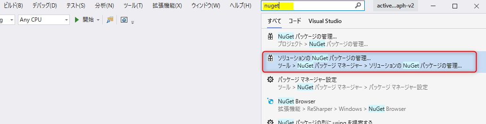
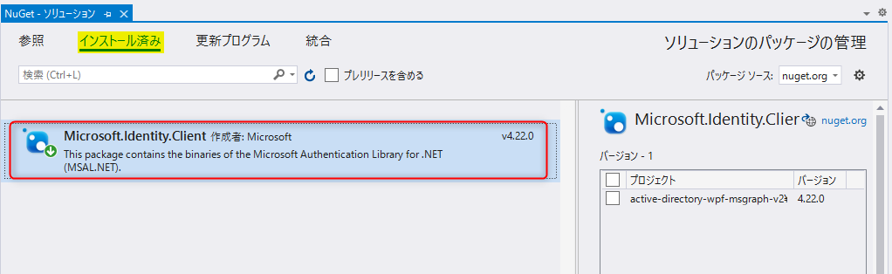
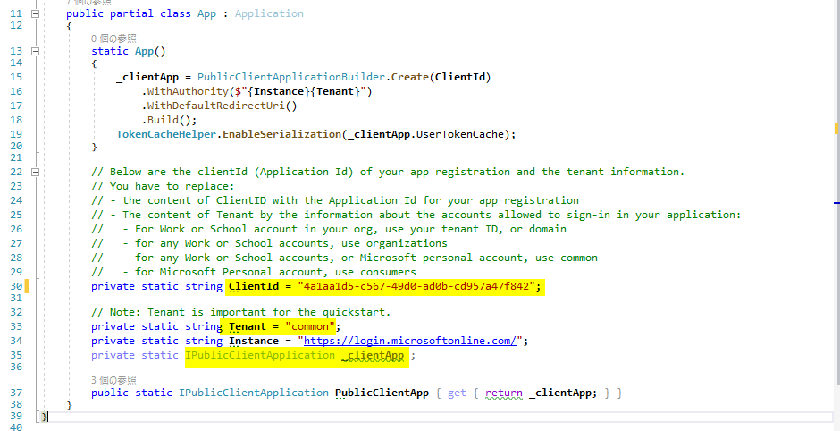
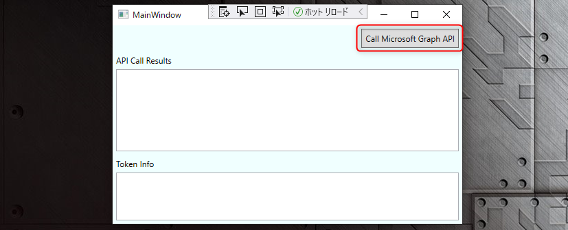
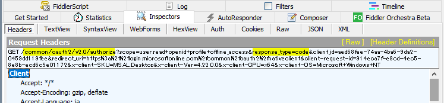
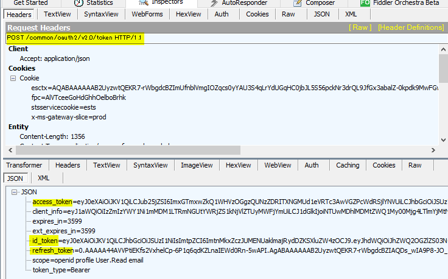
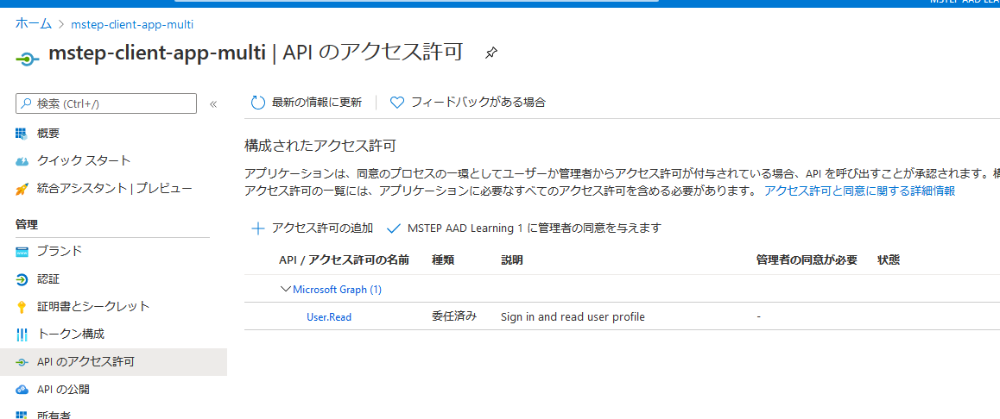

# WPF での認証

ここでは、マイクロソフトで公開している WPF のサンプルコードを使って Azure AD のマルチテナントでの認証を実装します。

## 📜 サンプルコードのダウンロード

ここでは、以下で公開されているサンプルコードを利用します。

- https://github.com/Azure-Samples/active-directory-dotnet-desktop-msgraph-v2

リポジトリーを `git clone` でクローンするかダウンロードして zip を展開して Visual Studio でコードを開きます。

 

## 📜 認証を構成する

### NugGet パッケージ

Visual Studio の上部にある検索に「nuget」と入力して **ソリューションの NuGet パッケージの管理** をクリックします。

 

**インストール済み** をみると、**Microsoft.Identity.Client** のパッケージがインストールされています。これが .NET 用の MSAL のライブラリーになります。"MSAL" というパッケージ名ではない点はご注意ください。

### App.xaml.cs の確認とマルチテナントの構成

ソリューションエクスプローラーで App.xaml.cs を開きます。

認証を行うためのオブジェクトは、`IPublicClientApplication` で定義されている `_clientApp` になります。static コンストラクターでインスタンスを初期化をする際に Azure Active Directory の情報を読み込んでいます。

`ClientId` に自身の Azure Active Directory のクライアント ID をセットします。

`Tenant` には `common` が設定されています。Azure Active Directory のアプリでマルチテナントを構成している場合、設定する値のルールは以下となっています。

|設定する値|概要|
|---|---|
|`organizations`|任意の組織のアカウントでログインできます。|
|`common`|任意の組織のアカウントと Microsoft アカウントでログインできます。|
|`consumers`|Microsoft アカウントのみでログインできます。|
|テナント ID|指定のテナントのアカウントのみログインできます（シングルテナントの状態）|

シングルテナント・マルチテナントを構成する際の注意点は以下です。

- Azure Active Directory のアプリで **サポートされているアカウントの種類** をマルチテナントを構成していても、クライアントの設定次第で構成が変わります。
- Azure Active Directory のアプリで **サポートされているアカウントの種類** で設定していない種類の認証はできません。例として、Azure Active Directory のアプリでシングルテナント構成をしていると、クライアントアプリでマルチテナントの構成をして、別組織のアカウントでログインしようとしてもログインできません。

> 🔎 このワークショップでいくつかのアプリ登録をしてきましたが、実際の開発ではどんなユースケースのアプリケーションを開発したいかに応じて **サポートされているアカウントの種類** を構成します。

### MainWindow.xaml.cs の確認

ソリューションエクスプローラーで MainWindow.xaml.cs を開きます。

実際に認証の処理を行っている部分です。

ポイントは `AcquireTokenSilent` と `AcquireTokenInteractive` です。

簡単に説明すると以下の動作をします。

- `AcquireTokenSilent` はメモリ上にキャッシュされているトークンを取得します。キャッシュが存在しない場合は `MsalUiRequiredException` 型の例外が発生します。
- `AcquireTokenInteractive` は Azure Acitive Directory にトークンを取得しにいきます。キャッシュはみません。

> 🔎 詳細は、[公式ドキュメント](https://github.com/AzureAD/microsoft-authentication-library-for-dotnet/wiki/AcquireTokenSilentAsync-using-a-cached-token) から確認できます。

デスクトップアプリやモバイルアプリのような パブリッククライアントでは、今回のサンプルコードのように、`AcquireTokenSilent` でキャッシュを確認して無ければ ``AcquireTokenInteractive` でトークンを取得するのが推奨パターンとなっています。

### デバッグ実行

MainWindow.xaml.cs の `CallGraphButton_Click` メソッド内の最初のコードにブレークポイントをセットしてデバッグ実行をして動作を確認します。

デバッグ実行をすると以下の画面が表示されますので、**Call Microsoft Graph API** ボタンをクリックします。

 

コードでブレークポイントがヒットしますので、1行ずつ進めていきます。

[Fiddler](https://www.telerik.com/fiddler) などのツールでネットワークを監視すると、`AcquireTokenSilent` ではネットワークの通信は発生せず、`AcquireTokenInteractive` が実行されたタイミングで Azure Active Directory の authorization エンドポイントがコールされることが確認できます。`response_type=code` になっていることから認可コードフローで認証をしていることがわかります。

 

デバッグを進めると認証の画面が表示されます。

マルチアカウントのアプリのため、このワークショップで作成した Azure Active Directory に存在しない他の組織のユーザーでもログイン可能です。

ログインして認証を通過すると、token エンドポイントをコールして、レスポンスの Body にアクセストークン、リフレッシュトークンと ID トークンがあることが確認できます。

 

認証によりトークンが取得できると、以降のコードではトークンを使って Microsoft Graph API をコールしています。これは、前のワークショップで Web アプリから Web API をコールした流れと同様のやり方になりますので説明は割愛します。

なお、Microsoft Graph API の呼び出しが可能なのは、Azure Active Directory のアプリにて **API のアクセス許可** のデフォルトの定義で Microsoft Graph で自分の情報を読み取る許可がされているためです。

もう一度 **Call Microsoft Graph API** ボタンをクリックすると、キャッシュされたトークンを利用するため、Azure Active Directory にアクセス行かずに Microsoft Graph API にアクセスしていることが確認できます。

 

### クライアントアプリでのマルチテナントの構成の変更

参考までに App.xaml.cs で `Tenant` の値を変えるとログインできるアカウントの範囲が変わることも確認できます。お試しをする際はローカルディスクに保存されたキャッシュの影響でエラーが発生する可能性があるため、ソースコードのディレクトリにある bin と obj のフォルダを削除して再実行することをお勧めします。

(正確には、`active_directory_wpf_msgraph_v2.exe.msalcache.bin3` ファイルを削除するだけで動作します。)

 

## 👍 まとめ

おめでとうざいます 🎉。

WPF での認証の実装と流れを理解し、プログラムを実行することができました。

また Azure Active Directory を利用したマルチテナントについての理解も深めることができました。

次は、SPA (Single Page Application) での認証に進みます。

 

---

[次へ進む: SPA での認証の実装](../5-4_spa/0_README.md)

