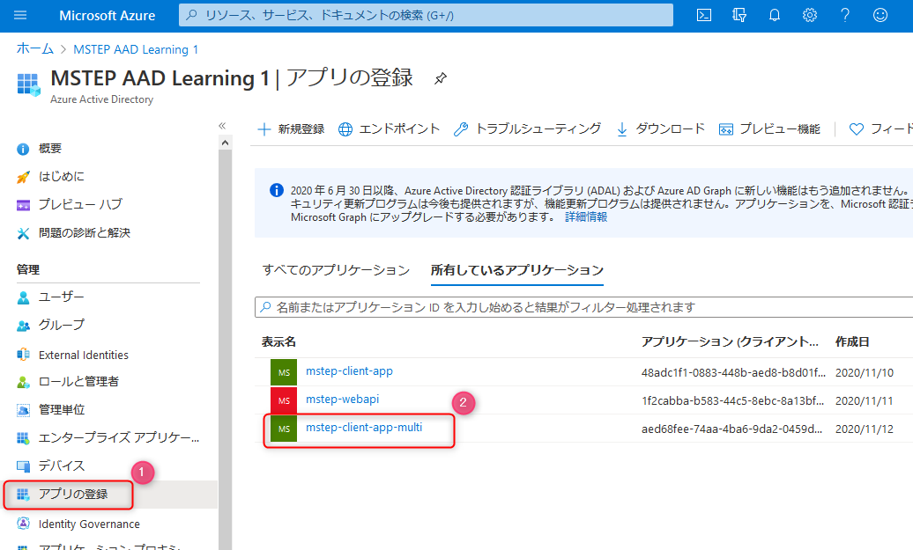
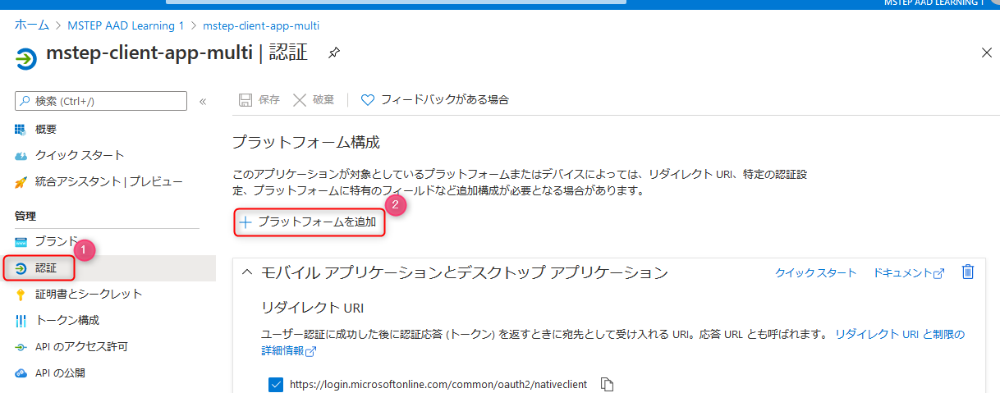
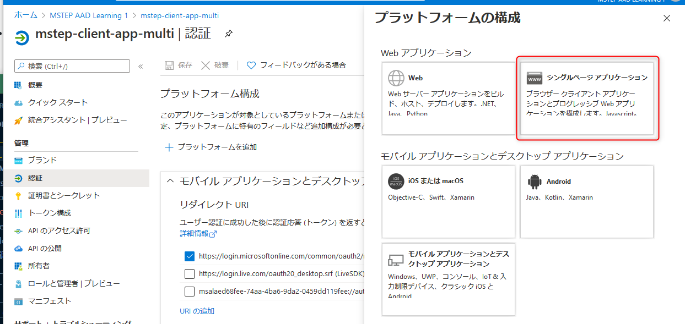
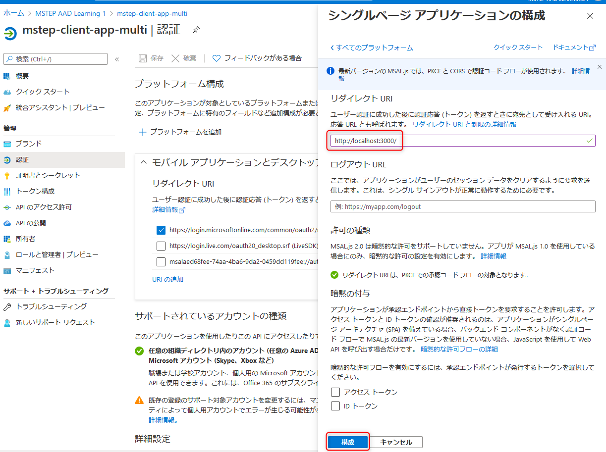

# 🚀 Azure Active Directory でアプリ登録を構成

SPA (Single Page Application) のアプリケーションを Azure Acitive Directory で認証するために必要な、Azure Active Directory のアプリ登録を行います。

今回は新規にアプリ登録を行うのではなく、前ワークショップの WPF のアプリを認証する際に利用したアプリ登録にプラットフォームを追加します。

 

## 📜 Azure Active Directory を表示

ブラウザーで Azure ポータルを開き Azure Active Directory のリソースを表示します。以下を参考に表示できます。

- Azure ポータル ( https://portal.azure.com ) を開きます。
- 表示された画面上部右に表示されているディレクトリが正しいことを確認します (図①)。異なる場合はディレクトリを正しいディレクトリへ切り替えます。
- 画面上部の検索で「active」と入力します(図②)。
- Active Directory が表示されますので、クリックします (図③)。Azure Active Directory のリソースが表示されます。

 

## 📜 アプリの登録: プラットフォームの追加

- Azure Active Directory のリソースの左メニューで **アプリの登録** をクリックします (図①)。
- 前ワークショップの WPF 用に作成した **mstep-client-app-multi** をクリックします。

 

- 左メニューの **認証** をクリックします (図①)。
- **プラットフォームの追加** をクリック(図②）します。

 

**プラットフォームの構成** で **シングルページアプリケーション** をクリックします。

 

**シングルページ アプリケーションの構成** が表示されます。  
リダイレクト URIに `http://localhost:3000/` を入力し、**構成** ボタンをクリックします。これで設定は完了です。

 

## 📜 まとめ

以上で、SPA のアプリで Azure Active Directory の認証をするための設定ができました。
次のワークショップでで以下の情報を利用します。メモしておきましょう。

- Web のリダイレクト URI で設定した値: `http://localhost:3000/`
- テナント ID と クライアント ID
  - 登録したアプリの **概要** をクリックすると表示されます。

 

---

[次へ進む: SPA での認証](./2_spa.md)
