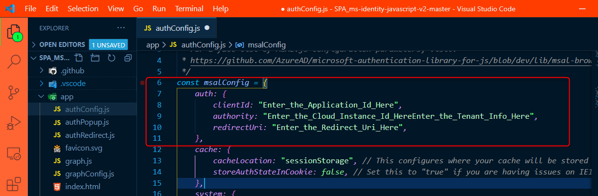
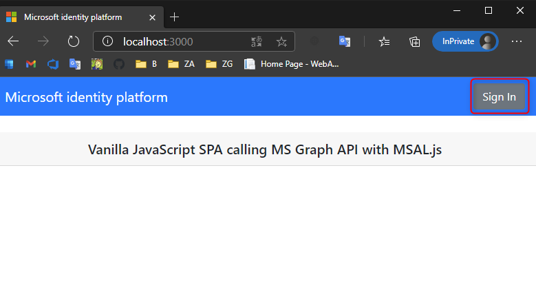
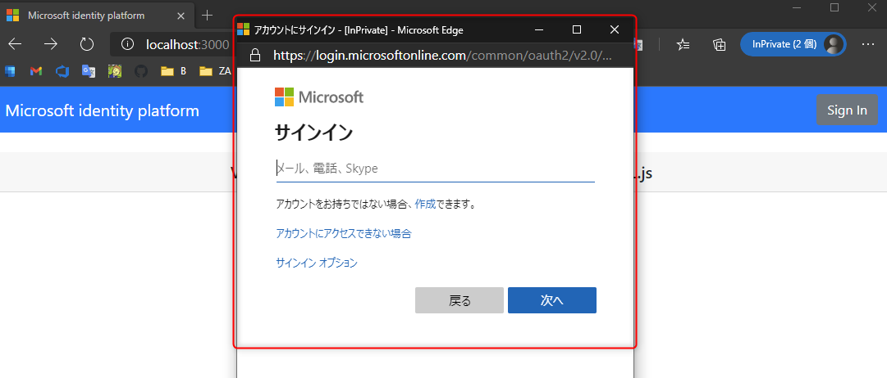
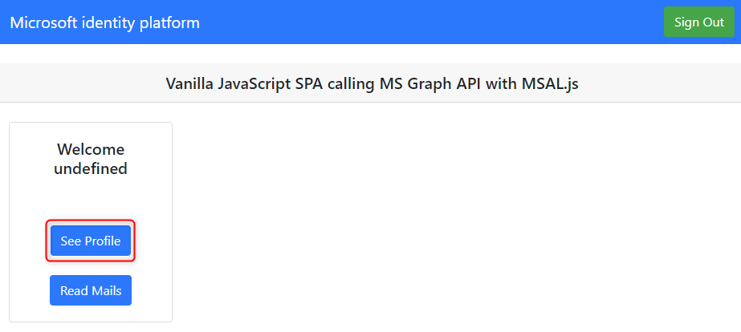

# SPA での認証

ここでは、マイクロソフトで公開している SPA (Single Page Application) のサンプルコードを使って Azure Active Directory のマルチテナントでの認証を実装します。


## 📜 サンプルコードのダウンロード

ここでは、以下で公開されているサンプルコードを利用します。

- https://github.com/Azure-Samples/ms-identity-javascript-v2

リポジトリーをクローンまたはダウンロードして zip を展開して (Visual Studio Code などの) エディターでコードを開きます。

<br>

## 📜 認証を構成する

### authConfig.js の確認

ソースコードで、**app/authConfig.js** を開きます。ここでは認証の構成を定義しています (図の赤枠)。Azure Active Directory の情報を使ってオブジェクトに値をセットします。

- clientId: Azure Active Directory のアプリ登録で確認したクライアント ID
- authority: `https://login.microsoftonline.com/common/`
- redirectUri: `http://localhost:3000/` (Azure Active Directory のアプリ登録で設定した値



<br>

authority の値は、WPF で確認した時と基本的に同様です。WPF の MSAL での実装と異なるのは、**`https://login.microsoftonline.com/` + 以下表の値をセットする**点です。以下の仕様をもとに設定することができます。

|設定する値|概要|
|---|---|
|`organizations`|任意の組織のアカウントでログインできます。|
|`common`|任意の組織のアカウントと Microsoft アカウントでログインできます。|
|`consumers`|Microsoft アカウントのみでログインできます。|
|テナント ID|指定のテナントのアカウントのみログインできます（シングルテナントの状態）|

> 🔎 詳細は以下ドキュメントで確認できます。
> - [Initialization of MSAL (microsoft-authentication-library-for-js)](https://github.com/AzureAD/microsoft-authentication-library-for-js/blob/dev/lib/msal-browser/docs/initialization.md)

<br>

### graphConfig.js の確認

ソースコードで、**app/graphConfig.js** を開きます。ここでは Microsoft Graph API にアクセスする際の URI を定義しています (図の赤枠)。以下の値を入力します。

- graphMeEndpoint: `https://graph.microsoft.com/v1.0/me`
- graphMailEndpoint: `https://graph.microsoft.com/v1.0/me/messages`

<br>

### authPopup.js の確認

認証に関する主な動作は MSAL.js がカバーしています。`PublicClientApplication` のオブジェクトが認可コードフロー (Authorization Code Flow with PKCE) での認証を実現しています。

ソースコードで、**app/authPopup.js** を開きましょう。簡単に要点を説明します。

`signIn` メソッドがログイン時にコールされるメソッドです。このコードでログインのポップアップを表示し、ログインが成功すると Azure Active Directory から取得したトークンをキャッシュしてくれます。

```js
function signIn() {

    /**
     * You can pass a custom request object below. This will override the initial configuration. For more information, visit:
     * https://github.com/AzureAD/microsoft-authentication-library-for-js/blob/dev/lib/msal-browser/docs/request-response-object.md#request
     */

    myMSALObj.loginPopup(loginRequest)
        .then(handleResponse)
        .catch(error => {
            console.error(error);
        });
}
```

<br>

サインインした後のトークンの取得は `getTokenPopup` メソッドで行っています。これは WPF で見たコードと同様の流れです。`acquireTokenSilent` メソッドで、サインイン時に保存したトークンのキャッシュを取得し、キャッシュがない場合や有効期限切れの場合は `acquireTokenPopup` メソッドで取得します。

```js
function getTokenPopup(request) {

    /**
     * See here for more info on account retrieval: 
     * https://github.com/AzureAD/microsoft-authentication-library-for-js/blob/dev/lib/msal-common/docs/Accounts.md
     */
    request.account = myMSALObj.getAccountByUsername(username);
    
    return myMSALObj.acquireTokenSilent(request)
        .catch(error => {
            console.warn("silent token acquisition fails. acquiring token using popup");
            if (error instanceof msal.InteractionRequiredAuthError) {
                // fallback to interaction when silent call fails
                return myMSALObj.acquireTokenPopup(request)
                    .then(tokenResponse => {
                        console.log(tokenResponse);
                        return tokenResponse;
                    }).catch(error => {
                        console.error(error);
                    });
            } else {
                console.warn(error);
            }
    });
}
```

`acquireTokenSilent` でトークンのキャッシュを取得し、無ければ `acquireToken***` メソッドで再取得をするのは、MSAL 共通の流れとなっています。

概要レベルの説明をしましたが、詳細はオープンソースとして GitHub で公開されているリポジトリーにドキュメントがまとまっています。

- [microsoft-authentication-library-for-js - msal-browser - docs](https://github.com/AzureAD/microsoft-authentication-library-for-js/tree/dev/lib/msal-browser/docs)

<br>

## 📜 動作確認

プログラムをデバッグ実行します。`npm install` > `npm start` でプログラムが実行されます。

ブラウザーで `http://localhost:3000/` を開くと画面が表示されます。右上の **Sign in** をクリックしてサインインします。



ログイン画面が表示されますので、ログインしましょう。



> 🔎 正常に動作しない場合は以下を参考に確認します。
> - ログインの画面が真っ白になっている場合は、`authConfig.js` で設定した authority の値が間違っている可能性があります。
> - ログイン後エラーが発生する場合は、`authConfig.js` で設定した値に問題があるか、Azure Active Drectory のアプリがマルチテナントの設定なっていない可能性があります。

正常にログインできると以下のように表示されます。**See Profile** ボタンをクリックすると Microsoft Graph API から情報を取得して画面に表示されます。




> 🔎 **See Profile** ボタンをクリックしてエラーになる場合は、graphConfig.js での設定に問題がある可能性があります。確認しましょう。

<br>

## 👍 まとめ

おめでとうざいます🎉。

SPA での認証の実装と流れを理解し、プログラムを実行することができました。

これでワークショップは終了となります。

<br>

---

[README へ戻る](../README.md)
